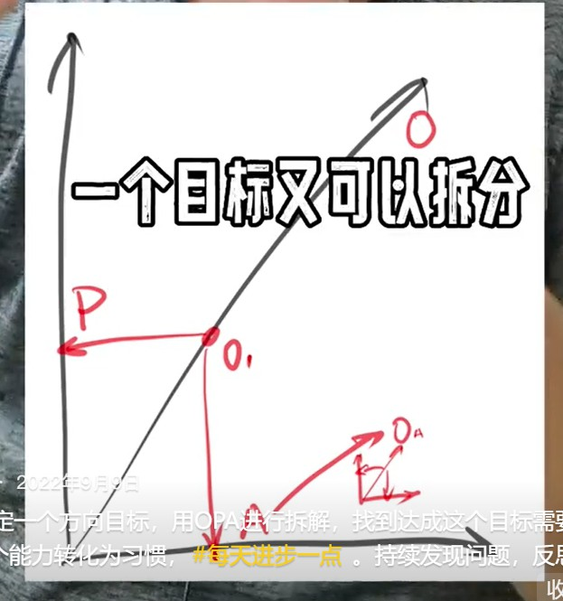
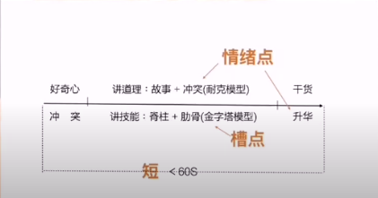

# 胡说笔记
## 2022.12.31 用一年时间改变自己

1. 每天拿出1~2个小时去完成那件最重要的，其他所有事情都排在那件事之后（二八原则）
2. 保证8小时睡眠
3. 每天写点什么
4. 熵减：每日健身、冥想
5. 对抗熵增：结识20位“有趣的人”
6. 掌握一项新技能
7. 做一件“对这个社会有益的事”

 2022.11.13 阅读时如何思考

 阅读时思考的方法。

1、复述；

2、提炼；

3、主题阅读，关键概念+不同场景，举一反三；

4、找到相关知识点，形成脉络；

5、学习这个领域思考问题的方式；

6、我怎么应用它？把它放到自己的知识体系里。

读一本书的时候，你要考虑如果你遇到同种情况会怎么样？然后再对照书籍里人物是怎么应对，然后比较。让自己参与进去，提炼思考！

> “进入一个领域最好的方式就是了解这个领域的【关键概念】，以及学习这个领域的人【思考问题的方式】。”

学习--思考--复述--提炼出关键概念，观点是由关键概念和逻辑组成，主题阅读核心是学习作者的关键概念和怎么思考问题的方式

## 2022.10.29 说说“知识变现”吧

知识是最有力的生产力。

举个例子。

货币是交易的媒介。

实物的真实价值取决于供求关系。“物价”则取决于货币的供求关系。货币是覆盖在实物之上的一层面纱，对经济不产生任何实际影响。这是宏观的角度。 

进入微观角度，假如一个小岛上只有10个苹果，1000块钱。每个苹果的价格应该是100。如果这个小岛上突然多出来1000块钱，每个苹果的价格就会变成200。苹果的真实价值并没有发生改变，但物价变了。

然而，有人提前拿到了多出来的钱，这个时候苹果的价格没有发生改变，但他手里的钱变多了，他就可以利用手里多出来的钱买、买、买。相当于他用100块钱买入了本该200块钱的东西。

有人后拿到钱，当他拿到钱的时候，小岛上苹果的“价格”已经上涨了。在这个过程中，有人的“钱”变多了，有人的“钱”变少了。 

让我们把眼光投到漂亮G。美联储放水，这个水首先会流向金融和房地产市场，一部分先拿到钱，这个时候物价并没有发生改变，先拿到钱的人就可以买、买、买；大量的购买推动生产要素的价格升高，劳动报酬升高（劳动报酬也属于生产要素的一部分，也就是后拿到钱的那部分人），物价升高，通货膨胀。

通货膨胀就要缩紧流动性，钱会变少，在此之前，一部分人会先于市场卖出。后拿到钱的人拿到钱不久，物价就开始上涨了。没有多少资产可以变卖，甚至因为劳动报酬增加了，反而开始买、买、买。每次量化宽松，都会形成这样一个循环：富的人更富、穷的人更穷。贫富差距拉大。 

这是一条非常简单的知识。可以被拿来一遍又一遍的反复使用。

然而，太多人偏偏不相信，有用的知识这么简单，又懒得去思考；总想从某处获得一个一练就会，甚至不练就会的“秘籍”。一次又一次的在商品价格上涨的时候开始买入，生怕错过机会；在商品价格下跌的时候卖出，生怕价格会更低。即便如此，仍然不愿意去思考，这问题的背后到底是什么。仅仅是做出一个简单的判断，某某人不靠谱。而最简单的知识难道不就是认真思考一条知识背后的真正本质是什么，认真把它搞懂，在日常生活中不断的小范围测试，不断验证、重构的过程吗？

## 2022.10.28 城镇化、工业化；服务、消费+互联网；新能源车、碳中和、高精尖

国家五年规划

## 2022.10.27 胡说懂的东西不多 就这几条

我这个人没什么文化，懂得东西不多，翻来覆去就那么几条。可就这么几条，让我获益匪浅。统一再说一遍，以后不说了
1、年轻人 (包括中年人) 最重要的是想清楚**自己到底想成为一个什么样的人**? **该如何为此而努力?如何更有效的分配自己的时间？**
这很重要，非常重要!**如果你自己没有目标。你会一辈子为别人的目标而努力。**
你不可能一下子就想明白，想不明白不要紧放放，过段时间再想，一边做一边想。
2、**没想明白之前，去阅读、写作，换位思考练习推销，学习投资**;并深刻理解**为什么**要阅读、写作、换位思考、练习推销、学习投资?
3、最简单的投资无外乎两样东西: **一个是钱，一个是时间。首先是时间。**
4、**真正的优秀不是你知道什么，而是你养成了怎样的习惯**。人家做一件事是下意识的，你还需要大量的计算。这就像人家可以随随便便提起 100 斤的重量，你还得去健身房锻炼。
5、允许自己被“利用”。你的生态位取决于你的“利用价值”

《学习是门手艺》

## 2022.10.17 阅读的方向

 宁可少读几本书，一定要读好书。找到合适的人，通过他找到合适的书，然后是更多合适的书。书在精不在多。

《文明现代化价值与中国》

《纳瓦尔宝典》《思考快与慢》《穷查理宝典》《 高效能人士的七个习惯 》

## 2022.10.16 改掉这个坏习惯

一定要自己阅读。干货是别人理解的干货，而你要做的是构建自己的认知。

## 2022.10.14 如何自学并快速获得成果

搜索就好，简单思考后找个路径，看点畅销书、八卦勾起兴趣，学习最基本的知识，就可以上路了，小挣点钱，然后逢山开路遇水架桥，缺啥学啥，多赚点钱，聘用比你厉害的人。

1、搜索

2、简单思考

3、看该领域的畅销书

4、看教科书学习基础知识，不要把所有知识学完了再去做【学生思维：准备好了再去做，永远在准备的路上】。

5、不断补足修正，边学边做。

《做时间的朋友》

跨入一个新的领域的时候【一边学习这个领域的知识，一边做这个领域的事情】
1.先找点有意思的知识点，产生兴趣
2.找到这个领域的基础知识，补充知识库
3.在自己学习的过程中，实践出来
4.遇到问题，学习解决问题的方法，最少且使用的方法

## 2022.10.13 最应该学习的技能

学习学习再学习，实践实践再实践。知行合一。

想要学会做什么之前，应该要先学会思考，去思考这个**技能的关键点**在哪里，**避免等靠要**。去借鉴前辈的经验和方法，判断当下自己处在什么位置，再去采用相对应的方法。

1. 自己向往的生活需要具有哪些条件？
2. 需要具备什么样的技能或者知识储备？
3. 目前还缺少哪些？
4. 如何做，能补足缺失的部分
5. 做出计划和具体去执行
6. 达到目标

## 2022.10.9 普通人怎么做点小生意

先把事做完，走通闭环，反思复盘，总结做的好的，固化经验，做的不好的吸取教训，然后再去考虑怎么做好。第一步的关键在于行动起来，不能停留在想象层面。

 观察、思考、小成本试错、反思总结、持续改进、学习；少一点等、靠、要。

试错。

**复盘。**

优化。

> 小小生意会发家。

## 2022.10.5 真正重要的事

如果你不知道自己的目标是什么，那么你的一生都是在努力实现别人的目标。

安东尼·罗宾的《唤醒心中的巨人》

《人类简史》

《枪炮病菌与钢铁》

《世界观》

《人物传记》

## 2022.9.26 如何碎片化学习并学以致用

《影响力》

扫读、卡片阅读法

碎片化、主题阅读

每天读点什么；每天思考点什么；每天写点什么

## 2022.9.22 如何阅读一本好书并学以致用

如何阅读好书，并学以致用。

把书读薄；

主题阅读；

写作是最好的思考；

养成习惯；

专门针对问题找到解决方案

刻意练习

---

用发散思维阅读。把以前知道的知识和现在了解到的知识联系起来。由点到线，再由线到面，再由面到网，试着把新旧知识联系起来

“我经常会犯的错误：列表”

## 2022 9.14

认真并反复阅读下面这段话:
钱是什么?
是交易的媒介。**其本质是供需关系**。
没有钱一样可以交易 (比如以物换物) 。两眼紧盯着钱，是赚不到钱的。钱提高了交易的效率，但它不是那个因。

要想在社会上赚到钱，**就要为社会提供有价值的需求且相对稀缺的东西**。如:文玩字画、黄金珠宝、房子、体力、时间、肉体、知识..

关注:交易是如何触发以及供需关系是如何建立的。看“手指的方向”，而不是那根“手指”
学习是最基础的元技能，你可以用它换取任何东西。**赚钱也是一种技能，也是可以学习的**，不要跟别人学怎么赚钱，赚钱这种事是教不来的。多看、多观察别人是怎么做的。**我所有赚钱的手段都来自模仿**。看看别人是怎么做的，**照着临摹，先做减法，把最基础的闭环自己全部走上一遍，用最小的成本去试错;再做加法，加入自己风格的东西，一点一点试错。然后是乘法，扩大战果。**
哪有那么复杂，看别人包做的不错，买回来拆了。把一些不必要的东西删了，再装上，试试效果;再拆了，加上自己的元素，试试效果;再拆了，打散重做，形成自己的风格
很难吗?不都是这么做过来的吗?美G这么干过，R 本这么干过，温州也这么干过。你也可以这么干。

## 2022.9.10 尽早学会赚钱

 **1、尽早掌握学习的方法，2、尽早掌握赚钱的方法。**

赚钱不是目的，赚钱是你必须掌握的手段。只有你不在为赚钱发愁的时候，你才可能最大限度的实现的人生价值。

尽早学会赚钱，哪怕是很小的一件事。从此你的思维会发生改变。

## 2022.9.9 普通人如何做成一件事

 确定一个方向目标，用**OPA**进行拆解，找到达成这个目标需要的能力。将这个能力转化为习惯， 持续发现问题，反思改进，PDCA。

达成目标：分解+思考+行动

总结一下：现有方向，小步快跑、迭代改进。不在乎自己的第一步是多么的不堪，先拿出来，逐步迭代。

## 2022.9.5 真正的刻意练习

《从达尔文到芒格》

《纳瓦尔宝典》

《巨人的工具》

## 2022.9.3 机会往往乔装成困难

狩猎文明->农耕文明->科技文明

迷茫是因为想的多做的少。

机会往往乔装成困难。

需求、客户、产品

1、自由市场经济，你能给别人提供什么好东西。

2、互联网时代，几乎不需要什么成本就可以获得大量用户。

## 2022.8.28 

如果你很努力，但仍然赚不到钱。那就要暂时停止努力了。

**你赚不到钱的原因，不是你不够努力，而是你不懂钱。**

人越有钱，就越懂钱;也就越容易赚钱

**赚钱不是目的，但赚钱是你应该具备的能力。**很多一谈到钱就嗤之以鼻的人，他们上大学的费用、结婚用的房子都是父母为其支付的。

你应该很早就学会赚钱。<strong style="color:red">尽早做点小生意。越早越好。哪怕它再小，都是完整的</strong>。这件事的意义不在于赚了多少钱，而是你能够完整的完成一件事，并通过它掌握赚钱的方法。<strong style="color:red">一个能够把事情做完整的人，他的视野、耐心、所掌握的知识的密度和常人是不一样的</strong>。

很多人一旦失去当前的工作，就失去了生活的来源。那是因为你从来就没有学习过“该如何赚钱”，而这恰恰又是你最应该学习的技能

学习赚钱，最简单的方法也不过是**找到那些“你”会为其花钱的小生意，想想他们是怎么赚钱的，然后依葫芦画瓢照着临摹而已**

## 2022.8.24

一个大概率可以跑赢市场的策略。
1、找到一支和民生息息相关的蓝筹股。即便开始走下坡路，也有足够的时间缓冲。同时也意味着你不可能获得太高的收益 (降低欲望)
2、在市场大环境不好、整体下跌，情绪剧烈波动时，瞄一眼市盈率(个位数)、和历史股价对比(处于历史低位)，以及每股净资产 (高于当前股价)
3、搜索与该公司相关的所有资讯 (排除因信息不对称造成的风险)。确认资产 (足够多)负债 (还的起)、现金流 (充足) 、净资产收益率 (至少>10%)。
4、看一下历年分红，如以当前股价买入可获得6%+以上收益最好。做好资产配置，划分出一笔长期不动的s
买入后市场可能还会下跌，不用管它。就当是长期存款。延迟满足。这样做的好处是:
1、当市场 (因库存周期、经济周期或宏观调策:民生) 上涨时，视情况卖出一部分。挣得是差价。
2、市场大环境不好时，拉长来看，平均每年可获得 6%+的投资回报。挣得是分红
3、破产清算时，把零件拆了卖。回收成本该策略特别简单但很难实施，因为这样的标的通常缺乏想象力，市场并不看好。而大部分人又很贪，且屁股根本就坐不住。仅适合像我这样能认清自己的蠢人。我的意思是: 很多蠢人认不清自己

## 2022.8.18 人生的方向

站在巨人的肩膀上。

1、名牌院校毕业典礼上的演讲

2、“巨人”的建议

3、人物传记

模仿+重复+坚持正确的动作+长期主义=成功的自己

《巨人的方法》

《富兰克林自传》

《纳瓦尔宝典》->《穷查理宝典》

## 2022.8.17 生命的质感

自己真正喜欢的事情。

人生的目标。

1、只有知道**自己想要什么**，你才能排除外界环境的干扰，做**自己真正想做的事**；

2、只有做自己真正喜欢做的事，你才会有创造力，才能真正把一件事情做好。

很多人没有目标，他们一辈子都在实现别人的目标；永远深陷在那个吃饭、睡觉、赚钱的漩涡里。

## 2022.8.14 不为清单

我们很多人关心的是：我要做什么事才能变得优秀。事实上，不做哪些事更重要。**找到那些经常给自己带来诱惑让自己陷入困境的事，设置条件打断它，或者用新的习惯代替旧的习惯**。

“如果我知道自己会死在哪里，我一定不会前往那里。”

## 2022.8.12 练习写作的方法

每天写点什么。

1、阅读时讲关键概念和知识点提炼出来，形成卡片。

2、将这些卡片穿连起来，看看人家是怎么写的。

3、**过上几天，把原文打乱，用自己的话重写，和原文做对比**。没了，只要你肯做，一年，就一年时间，脱胎换骨。

《卡片笔记写作法》

《富兰克林传》

坚持阅读、写作、提炼、总结、反思，重构形成习惯，将其做到极致那就是绝招

## 2022.8.11 一定要掌握的技能

1、阅读是最基础的元技能，你可以用它换取任何东西

2、写作本身就是思考的过程，一边学习一边输出，学习的过程和心得

3、换位思考，站在对方的角度思考

4、【销售】是获取财富的关键。普通人可以学习【演讲】、【新媒体】，

5、【投资】。睡后收入

## 2022.8.10 成事的方法

【找到一件值得做的能产生复利的事】

【尽你所能穷举达成该能力的所有方法】

【找到最简单最有效的方法，形成习惯】，从每天写点什么，每天做个冥想，解决一个问题，定投开始

【延迟满足，分享价值】

量变质变律

每天做点什么，每周做点什么，持之以恒。

每天写点什么，每天说点什么，每天学点什么。

想拥有一样东西，最好让自己配得上它。

《乔布斯的魔力演讲》

## 2022.8.8 晒出你的”土“

1. 【活出你自己】，做自己，不要给自己设限
2. 【如实真实】晒出你的作品和生活状态

## 2022.8.6 推荐几本成功学的书

有空看看那些真正的成功学领域的书吧。而不是那些大师的课程。几十块钱，它能骗你啥？开拓一下思路，是时候，给自己洗洗脑子了。

- 《每周工作四小时》

- 《重来》

- 《把握现实》

- 《浪潮式发售》

- 《巨人的工具》

## 2022.8.2 普通人的第一桶金

重要的是桶而不是金。有了第一桶金就能有第二桶金，第三桶金，...

太阳底下没有新鲜事。

阅读是最重要的原技能，你可以用它换取其他所有事物。很多事情，人家已经做过了，分享给你了。你居然视而不见。看到了，却又自以为聪明的拒之门外，还有比这很愚蠢的事吗？没有了。

- 阅读
- 执行力

别人分享给你，你就会了吗？

## 2022.7.27 让自己发生改变的方法

只要你想改变，就一定伴随着不舒服。

1、【第一性原理】，目的是什么？向牛人学习经验和方法，穷举一切手段；

2、【剃刀法则】，保持足够简单。寻找他成功之前的网上痕迹。1：1“战地日记”

## 2022.7.25 不是很好，也可以很好

如果一件事可行，你甚至都不需要为此设定目标，将它转化为一种习惯，每天写点什么，每天说点什么，每天做点什么……不用很好，也可以很好。

坚持做喜欢擅长且复利的事情！！！

## 2022.7.22 不花钱 增长见识，结交人脉的方法

前提一：利用规则。跳出规则。

前提二：借鉴他人。莫要闭门造车。

首先扩展思路，增长见识，

然后就要能给他人提供解决方案，交到朋友扩大圈子，最终赚钱也是水到渠成

## 2022.7.21 普通人的第一桶金

从哪来呢？

- 敢为天下后

- 熟读唐诗300首，不会读书也会吟

---

1.模仿 

2.拆、分析 

3.低成本 

4.看反馈 

5.复制

---

1.先学走路再学跑，学会模仿。
2.多看案例进行分析。
3.低成本。
4.眼见为实，耳听为虚。 注重实践。
5.【星星之火 可以燎原】积累客户进行复制。

## 2022.7.18 随处可见的商机

太阳底下没有新鲜事。过去发生过的事，大概率还会上演。

“几乎所有眼前的事情都是过去发生过的重复。”

看信息前后上下看：
（一）前：过去发生过什么
（二）后：未来可能会发生什么
（三）上：这个事的真正需求是什么
（四）下：我们到底该怎么落地

## 2022.7.14 做事的方法

- 学会用**最小的成本去试错**。成功了当然好，失败了也没有多少损失，总结经验。

- 先别把事想的太好，以60分为标准，做到60分，再决定下一步该怎么走。

---

做一件事，先用最小成本跑一个MVP闭环出来
1:把产品给陌生人，目的是获得【真实反馈】
2:如果反馈还行，可以尝试进入代销渠道，目的是获得大的市场真实反馈。【更大范围的反馈】
3:根据反馈结果，再决定是否加大投入和规模【是否加大投入】

## 2022.7.13 天才是怎么养成的？

#### 勇于尝试，不给自己设限

1、本来啥都没有，失败了还是啥都没有，怕啥？

2、本来就是坏的，修不好还是坏的，怕啥？

3、有人干过，那就说明可以干。唯一要考虑的就是值不值得干。

---

1.人生来本就一无所有，何必害怕重头再来
2.敢于尝试，只要试错成本低就可以去做；没成可以接受，成了就是很大的收获
3.选择一个赛道，只要有人做，而且成功了，就可以去做

## 2022.7.10 如何成为一个牛X的人

#### 【快速进入一个领域】

---

1.学习这个领域的畅销书，总结长文（自学能力）
2.以记者视角线下采访这个领域的牛人（读懂他人的能力），推荐书or人or社群
3.加入2中推荐的社群；做成新闻稿（反思、总结知识）
4.尝试分享给他人（把知识转化成价值）【演讲、文章】

---

1.读3～5本畅销书，搭建框架
2.读完输出一篇长文，检验自己的理解程度。
3.采访牛人，跟拿到过成绩的人学习。进入他的社群，读他推荐的书。
4.分享输出创造价值，以教为学。【演讲、文章】

## 2022.7.7 普通人破局的2个破局点6种方法

#### 2个破局点&6种方法

破局点1：穷

1. 降低欲望。昂贵的手机、衣服、车、房子。

2. 外包。金钱换时间。

3. 断舍离。二八原则。

破局点2：认知

1. 结实牛人
2. 进入圈子，社群
3. 利用游戏规则，降维打击

## 2022.7.4 人与人之间的差距

人与人之间的差距大概就是从一个个小的障碍开始的吧

每一个问题都是一次机会

## 2022.7.2 如何成为一个厉害的人？

发现问题，解决问题，优化再优化。

一个人为什么抱怨？一个产品为什么能成功？解决了什么问题？解决了什么人在什么场景下的什么需求？

先复制，做到60分，70分，80分，90分，...

## 2022.6.23 挣点小钱 提高财商

做事没那么难，无外乎就是找到有问题的人，帮他们解决问题。我们只需要做到两点：

1、【模仿】把现成的解决方案应用到还没有被解决问题的地方；

2、【优化】为已经被证明的需求提供更好的解决方案。

## 2022.6.21 死循环 & 破局点

穷->时间换生活费->没有更多时间自我提升->能力得不到提升->花更多时间换生活费

穷->视野和认知不够-> 没有更好的选择->视野和认知打不开

降低欲望，忙里偷闲学习提升自己，尽可能的去开拓自己的视野，从而提升自己的价值输出获得现有生活费之外的钱，再用这个钱持续去提升自己，从而进去后者良性循环

- 手机够用

- 车够开，代步工具

- 平价衣服

过早背上房贷！

## 2022.6.17 你的首要工作

【寻找客户】，时刻想着为别人提供价值。

如果因为你的加入，我们的餐桌上每天多出4块肉，我不介意你拿走其中的3块肉。

【产品】>【业务】>【技术】

## 2022.6.15 普通人如何改善自己的生活

普通人：没钱、没资源、没能力、没人脉，唯一可以支配的是：**时间**。

重要且紧急、重要但不紧急，不重要但紧急，不重要也不紧急

好钢要用在刀刃上【时间管理、时间分配】。

- 少走弯路，学习路线图
- **喜欢，擅长，且能产生复利的事情**

## 2022.6.13 胡说是怎么学习的

1一定要多思考
2 积攒知识碎片
3 发挥碎片价值
4 储存知识碎片
5 价值交换/输出

自我提升+资源整合+价值交换+利他思维==达成互利

## 2022.6.9 做成一件事的最基本要求

#### 把一件事做完整。先完整，再优化。

先完成60%，再完成剩下的40%

## 2022.6.8 学习的方向 

你的价值=你的能力+buff

普通人可以掌握的两个buf：

1. **演讲能力**
2. **写作能力**

输出能力+写作能力+自己的宣传能力（影响力）不断地利他主义=自己不断的进化

## 2022.6.3 如何认识一些有价值的朋友

一、价值交换

二、认知交换

## 2022.6.1 如何提升财商

如果你打算做一件事，那就马上行动，花时间专门研究它。在前人的基础上建立自己的知识体系和行动框架。不要和我说什么纸上谈兵，能做到这些的人行动力只会比你强，不会比你差。

1.【全网搜书】，买好书
2.【主题阅读】 以获得洞见获得灵感为主，一定要写点什么
3.【内外案例】一定要找国内国外对应的案例
4.主题读完可以写长文
5.加入一些组织进行交流，写一篇论文出来，发到好的论坛上

## 2022.5.30 分享几个原则

1、【**二八选择**】，蕞重要的事只有一件；把80%的时间和精力用在20%的事上，剩下的20%时间和精力去完成80%的事。最重要的事情只有一件。

2、【**第一性原理**】，找到那件最重要的事情之后，思考它背后的本质是什么？

3、【**剃刀法则**】，目标分解，找到蕞重要的核心任务；

4、【**持续升级算法**】，先从加法做起，然后是乘法……

5、【**降维打击**】，你是落后的真正原因。

## 2022.5.29 如何提升财商

#### 多看，多想，多分析

思考线索：

1.【客户是谁？】搞明白这个事到底挣的是谁的钱；

2.【需求是什么？】挣的是什么钱？真正的需求是什么；

3.【营销方式？】他是怎么营销的；

4.【落地方案？】怎么落地，怎么付款的。

## 2022.5.27 如何提升自己

如何提升自己？

1、关注工作之外的时间，都用在哪儿了？

2、不要限制自己，走出去，视野开阔了，才会有更多的选择。

3、有点小事，赚点小钱；再小的事它都是完整的。更重要的是你掌握了成事的方法。

4、别总想着和别人不一样，首先做到一样，然后才是不一样。

5、大多数人总想着改变自己，不过是想想而已

## 2022.5.26 普通人如何做副业

认真学习、思考，破圈；

扩展认知，寻找认知差，发现“商机”，然后切换到其它“尚未实现该价值的领域、城市、人群”，重新再做一遍。

## 2022.5.20 分享一个赚点小钱的思路

1. 

## 2022.5.16 来条“高级的”

看到，打断，重新设计“执行路径”，这很高级。

每日三省吾身。

观念头。

人和人的差别，有的人被自己的欲望控制，有的人能控制自己的欲望。

## 2022.5.15. 一定要警惕！不要成为这样的人

“见不得别人好”

损人不利己。你不行，我行；我不行，你也别想行。

妒忌是一种最愚蠢的行为，它带不来丝毫乐趣，只有痛苦不堪。

远离这样的人。

恨你有，笑你无，嫌你穷，怕你富。

## 2022.5.13 分享2句话

1. 为自己学习，主动学习。
2. 为自己打工，主动打工。

《穷查理年鉴》

- 不管为谁打工，都要为自己学习。坚持用心工作、用脑子工作，用好每一分钟去积累去提高自己的能力。
- 学习投资，也是为自己打工，做股东，把钱投给优质的公司，让公司为自己赚钱，让金钱永不眠的为自己赚钱嘛。

## 2022.5.11 怎么赚钱

废物很多，并不是什么稀缺资源。

写软件。

写书。

写文章。

拍视频。

巴菲特说最好的投资是投资自己，用能力带来稳定现金流，现金流积累原始资本，用原始资本购买能带来现金流的资产，然后财富自由。

拥有稀缺资源。

## 2022.5.9 做正确的事

做正确的事，如果你想赚很多钱，那你努力的方向就不应该是朝九晚五的固定工作。

没有谁是通过出售自己的时间获得巨额财富的。

你收入里至少有一部分应该来源于你创造的结果。

只有方向是正确的，才可能带来正确的结果。

## 2022.5.6 一个重要文件

《关于推进以县城为重要载体的城镇化建设的意见》

## 2022.5.5 持续做，持续赚钱

1. 你得做成点什么事
2. 你做的这个事大家跟着一块得到好处。

1.自己有绝对结果
2.值得别人可信赖
3.获得精准高意向粉丝
4.利他就是极致的利己

## 2022.4.29 赚钱的思路

产品、用户、销售。

好用户（有需求）+好产品（有价值，边际成本低），好连接（销售）

1.利他就是最大的利己
2.找的好产品与有需求的群体，自己充当中间的桥梁
3.扩大有需求群体的范围×复购率=源源不断且会增长的子弹

## 2022.4.26 四件事

1. 亏了34万

2. 看到自己的欲望

3. 重读投资经典书籍

4. 建仓加仓

## 2022.4.18 推荐书单

《钱》

《非凡的成功》

===

《穷查理宝典》

《彼得林奇的成功投资》

===

《周期》

《投资中最重要的事》

===

《贫穷的本质》

## 2022.4.15 怎么赚钱

阅读、理解、思考

## 2022.4.14 两碗鸡汤

1. 天塌下来，都必须有一个固定的收入
2. 流水不争先，挣的是滔滔不绝
3. 给别人他想要的，他也会给你你想要的

## 2022.4.6 普通人最应该学习的一项技能

1. 阅读
2. 与聪明人为伍（拥有一技之长）

## 2022.3.31 知识就是财富

政策

天下没有白走的路

## 2022.3.30 视野、机会与选择

战争、疫情、通货膨胀、金融危机的担忧、加息、地源政治，人们恐慌的情况下。

## 2022.3.28 参考资产配比

1. 未来1年的生活用度
2. 60%的股票持仓，5支深度分析过的标，3支如有机会做T降低持仓成本
3. 40%，小部分黄金，以宽基指数，分成若干份，每周五智能定投

## 2022.3.21 认清自己是谁未必是件坏事

1. 多数人不具备独立选股的能力
2. 不知道怎么估值一家公司

指数基金

## 2022.3.13 让自己保持贫穷的秘诀

真正的投资

- 脑子不好使
- 总想着快速致富

## 2022.3.9 一些选股的方法

1. 市净率<1
2. 货币资金=总值
3. 净流动资产足够偿还债务

## 2022.3.2 推荐一本书

《枪炮病菌与钢铁》

## 2022.2.14 推荐3本书

《非凡的成功》

《怎么选择成长股》

《投资最重要的事》

初学者最好的学习投资的方法是模仿大师。--巴菲特

## 2022.2.7 一个优点

越是无能愚蠢的人，越是在意别人的看法。

脸面这个东西，越无能的人越看重。

## 2022.2.5 你怎么可能穷呢？

每天写点什么，不是记流水账，感知和理解。

每天写点什么、 对这个世界的理解、感悟 思考它能解决什么问题（定义问题） 能用在什么地方（解决问题）

问题是什么，怎么解决

## 2022.1.29 这个世界上最好看的人

世界观、人生观、价值观，你的选择是由你的认知决定的。

李录《文明、现代化、价值投资与中国》

《原则2》

《枪炮、病菌与钢铁》

## 2022.1.19 如何用最快的速度学习一项技能

##### 二八原则学习技能，60分进入一个领域。

1. 花20%的力气完成一件事儿的80%后收手。
2. 然后再用剩下80%的力气，实现另外4件事80%的效果。这样就花费了100%的力气，实现了别人500%的效果事半功倍倍倍

## 2022.1.9 年轻人最应该学什么？

1. **一技之长**。通过刻意练习获得一技之长。坚持刻意练习。
2. **定义、解决问题**。通过阅读、思考提升定义问题、解决问题的能力。

## 2022.1.6 做事情分两步

1. 完成。完成就好。
2. 想办法让这件事变得更好。

很多人是倒着的，不行，我一定要一步到位，力求每一件事情都很完美。于是，他们大部分人连完成都做不到。

还有一些人做完就完了。做好和做完没啥区别，又不多发工资给钱，差不多就行了。于是他们总是十几年或者几十年如一日地完成60分的东西。于是，他们永远只能拿到60分该拿的薪水。先完成再完美。先拿到60分，然后是80分，然后81分，82分。

反思、复盘、纠错、重构、迭代、验证、周而复始

## 2022.1.5 如何阅读

阅读，读的是2个东西：

1. 知识点（关键概念）。
2. 结构（模型）。

进入一个领域，学习的就是这个**领域的关键概念**和这个**领域的人思考问题的方式**。

## 2022.1.1 啥叫每天写点什么

每天写点什么，是一种健脑行为。

>可先抄，这也不是容易的，有基础后，脑里才有东西，写东西需时间积累，训练逻辑。慢慢会获得“洞见”。书开始看不下去的，坚持看，与书发生关系，联系到自己的实际或过去。慢慢的积累，产生洞见。得到自己的理解。

## 2022.12.31 2022用一年时间改变自己

1. 每天写点什么
2. 每天抽半个小时锻炼身体
3. 每个月拿一部分钱用来投资
4. 掌握一项新技能
5. 做一件对这个社会有益的事

## 2021.12.30 怎么写作

1. 有东西可写
2. 形成段落
3. 组织好段落

“大家别信他，他是让我们养成看书写感悟的习惯！看一页书的目的是坚持去做就行（不可能只看一页）。我就是这样上当的，上学看书就睡着，现在一本书几天就看完了”

## 2021.12.16 临摹，从60分到多维竞争力

很多人连临摹和抄袭都分不清楚。你听过抄作业，你听过抄字帖吗？你听过临摹字帖，你听过抄字帖吗？
居然还有人大义凛然的和我说不要抄袭？不学无术！

## 2021.12.19 真正的奢侈

<strong style="color:red">有大量的时间可以浪费！！！</strong>

## 2021.12.12 扩大知识的来源

如果你对这个世界的理解是对的,那你的口袋里—定有你想要的东西。**否则,就应该停下来,认真回想一下过去的生活**。是不是哪里出了问题?要不要沿着之前的轨迹继续生活下去?爱因斯坦说:“**疯狂就是重复做一件事，却又期待不一样的结果”。**

有些事我已经说过很多遍了，但我想再说一遍。你不是第一个来到这个地球的人，**你要做的事很多人都已经做过了，向他们学习。向那些真正取得过成绩的人学习。**我希望你能够理解什么叫真正。我不建议你向那些宣称自己“一个月挣了多少钱"或者“一年挣了多少钱”的人学习，**离他们远点儿**!我做网红有一段时间了，如果那种钱能挣，我早就挣了。

把看我视频的时间，拿去**阅读一些类似富兰克林这样的名人传记吧**。少读—些“小报和八卦周刊”,哪怕仅仅是扒着井沿，向外面看一眼。你都会明白，**像我这样的人,不过是在村口转了一圈的村民，不应该成为你知识的主要来源。**

## 2021.12.11 再谈阅读的方法

准备两杆笔：一管荧光笔；一管铅笔

## 2021.12.9 你是来送钱的

每天花1个小时看本书，花8分钟看个TED演讲，花1周时间搞明白一个关键概念，今天醒来比昨天进步一点点，生活就会好很多。

想学写作，就是看几本“读者”都可以写了。

想做知识主播，多看看TED演讲，照着临摹都知道怎么做。

想靠投资赚钱，多花点时间研究一下巴菲特、芒格、彼得林奇，你都不会亏。

很多亏钱的人是连一些基本常识都不知道！

## 2021.12.3 贫穷的原因

你把时间和精力用在哪，你的成就就在哪。

亚当斯密：市场运行规律；

纳博科夫：如何写作；

乔布斯：演示然后演讲；

西奥迪尼：如何营销；

查理芒格：如何投资赚钱～

## 2021.12.2 推荐的副业

##### 知识主播

1. 阅读理解能力
2. 转化输出能力
3. 表达共情能力

学习闭环，产品闭环和投资闭环再分别对应计划行动POA模型的短期、中期和长期计划的三个阶段

## 2021.11.30 走出困境的方法

1. 钱是交易的产物。即便到困境，你依然可以通过时间与体力与人交换，只要有手机，你就能建立交易的链接
2. 走出困境的方法，还真是多想想如何可以帮别人做点什么。

---

主旨：钱是交换的产物
1、人再穷，也有体力和时间可以和别人交换
2、能给别人带来价值的人，就是高价值的人

## 2021.11.25 你的世界和真实的世界

- 阅读——让我们看到别人对这个世界的理解
- 学习——是把别人的观点融入到自己的理解中
- 思考——可以帮助自己找到主观世界和客观世界中间的断层
- 反思、复盘——是重构我们对这个世界的理解

## 2021.11.21 摆脱贫穷的方法

那就是帮助他人，成人达己。

帮助别人，给别人解决了问题，就等于别人提供了价值！作为交换，要么你直接获得了钱，要么获得的是别人的信任！而信任是可以帮你创造钱的！

## 2021.11.15 关于常识、复利、投资、行动 

**常识**：

信息时代，帮助你获得成功的，往往是人人皆知常识，只有你能做到的常识。

**复利**：

- 初始资金
- 回报率
- 时间

**能力**：

明天掌握的能力建立在今天掌握的能力的基础之上。**现在、立刻、马上**。

**行动**：

知而未行为不知，知行合一为真知

种一棵树最好的，时间是十年前，其次是现在

正确指引你人生方向的人。

## 2021.11.6 做自己喜欢、擅长、复利的事

—定要做自己<strong style="color:red">喜欢、擅长、复利</strong>喜欢、擅长、复利的事。

什么叫喜欢？比如你玩游戏的时候，**吃饭也忘了，睡觉也忘了，走路、坐公交、坐地铁、做火车、坐飞机都会玩游戏，这就是喜欢**。

什么是擅长？**擅长是可以通过（刻意）练习达到的**。如果有天赋那就更好。一件事儿即使你没怎么练过，但仍然可以完成的很好。那就是**天赋**。

**复利**是可以叠加的。越做越好，一年比一年好。才会出现指数级增长。

如果你现在还没找着这样的事。**现在就去找。各种尝试,像苍蝇一样乱撞**。越早越好。

没有找到之前,别闲着。去做一些未来你一定会用到的事儿。**既然学习很重要,那就先学习怎么学习。既然思考很重要，那就学习怎么思考。**既然为钱是交换的产物，那从现在开始，就去帮助别人，努力给别人提供价值。

## 2021.11.3 投资的本质

每个人都有两个东西可以用来投资

1. **钱**。尽早学习用钱生钱。
2. **时间**。尽可能把更多的时间用来升级自己的`"操作系统"`。

年轻时：时间=>钱 （只能）

年老时：钱=>时间 （被迫）

**不要轻易出售自己的时间，除非万不得已。**

尽早由**时间=>钱**切换到**钱=>时间**：

1. 腾出更多的时间提升自己。More Time.
2. 从而提升时间的单价。Higher Price.
3. 可以出售更少的时间。Less Sell.
4. 腾出更多的时间提升自己。More Upgrade.
5. **复利**

## 2021.10.30 投资，你能投的不过就是精力和金钱

年轻时没钱，只有精力。

**用精力换钱最不划算,没有成长性**。

把精力投入到技能上，用技能换钱，好一点。**你的收入取决于技能的可替代性**。

**把精力投入到思想上，用别人的精力为自己赚钱，你好腾出更多的精力思考。**劳心者治人，
劳力者治于人。普通人一定会经历**用精力和技能**换钱这两个过程。

如无特殊原因，**年轻时在保证温饱的情况下，应该把更多的精力和钱投资到如何提升自己的思维上。尚有富裕，用在投资上，越早越好。**

随着年龄的不断增长，你被动收入的比例也越来越高。1、你的钱会帮你生钱。2、你的思想会帮你生钱。

你不用再为生活而奔波。**真正的富人,是那些有大量的时间可以用来挥霍的人。**

## 2021.10.28 写作是你最应该掌握的技能

1、最好的学习莫过于：**把你知道的讲给别人听**。讲不出来，说明你不会。
2、**写作可以帮助你获得大量的粉丝**。大公司需要支付巨额的广告费，才能获得用户。
我们不需要，我们有粉丝。我曾经用10分钟创作了一条文案，获得了28W粉丝。没花一分。有人说，获得同等数量的粉丝，需要缴纳26w8。弱爆了!这难道不是一个锤子便签就可以搞定的事吗?
3、**写作可以帮你赚钱**。
写作是少有的花费一份时间，却可以卖出很多份的主动技能。几乎不需要任何成本。
完成之后可以持续享受“**睡后收入**”。
而且无论是谁，不分学历，不分大小，不分美丑、高矮胖瘦......**几乎没有任何门槛,不需要找门路拖关系、不需要考取任何证书、不需要本金就可以从**事的职业。
而且你**根本不需要专门去学它。**你在小学的时候就已经会了。

## 2021.10.24 最简单的投资

- 长期坚持
- 刻意练习

普通人，只需要：

1. 从烤串、化妆品、游戏皮肤、视频会员、名牌包包、手机、平板、电脑、相机、镜头等消费品中省出10%~20%，**投给任何能够生成现金流的资产**，哪怕这部分钱，全部亏掉，一份不剩。
2. 每天从游戏、电视剧、信息流、扯闲篇里抽出30分钟看本书，理解它，实践它，把它用到生活中，哪怕99.9%的知识你根本就用不出来。

## 2021.10.21 普通人致富的方法

阅读、思考、写作

- 阅读——博览众长
- 思考——整理吸收
- 写作——行成自己的思维逻辑

## 2021.10.19 打造你的专属印钞机

关注且信任你的用户名单。

钱是交易的产物，钱是信用的度量

## 2021.10.18 克服恐惧

克服恐惧的最好方法，就是逼着自己：<strong style="color:red">去做！</strong>

根本就不存在一鸣惊人，所谓的一鸣惊人，只是你不知道人家在默默无闻的时候，付出了多少努力。

## 2021.10.15 说服他人最好的方法：让他进入场景

不是摆事实讲道理，而是让他进入场景。

案例：售楼部样板间

## 2021.10.13 摆脱困境的方法

几乎所有的问题都能被解决，只要你肯花时间。

废物是控制不住自己的：

- 贪图享乐、贪财贪色
- 作息不规律

废物就是可以用诱饵随意玩弄的小白鼠。

## 2021.10.11 普通人如何实现财富自由

1. 多少存点钱(节流)。减少不必要的开销
2. 别做蠢货。每天照照镜子，哪有那么多好事找你这个普通人？你何德何能？
3. 温饱->小康->富足->自由
4. 资产配比。15%、55%、30%
5. 向大师学习。
6. 给与，利他就是利己。

## 2021.10.6 最重要的一套心法

冥想、内观、元认知。

找一个相对安静的环境，坐着或躺着，排除杂念，什么都不想。过一会就会有一个念头冒出来，当你看到这个念头的时候，它就被打断了；过一会就会有一个新的念头冒出来，然后又被打断。如果你可以看到自己的念头，你就可以看到自己的欲望；如果你可以看到自己的欲望，你就可以看到他人的欲望。一个可以看到他人欲望的人，他就可以看到钱。一个看到自己欲望的人，你就有机会和自己的欲望和谐相处；一个可以和自己的欲望和谐相处的人，是非常强大的。

## 2021.9.27 拉闸限电

独立思考很重要，不要人云亦云

## 为什么一定是电？

##### 四条确定的赛道

1. 电力系统是双碳的主战场
2. 光伏、风能、储能、特高压

## 2021.9.8
#### 个人商业模式

##### 普通人如何提高收入？

第一步：学习如何学习

第二步：学习如何思考

第三步：持续学习、思考；等待复利

一旦停止阅读，停止学习，废！

## 2021.9.2
#### 如何阅读财报

2个维度

- 收益
- 风险

3张表

- 资产负债表
- 利润表（损益表）
- 现金流量表

几个关键指标

- 负债率
- 毛利率
- 净资产收益率

## 2021.8.31
#### 最好的学习资料

证券公司官网，招股说明书。

## 2021.8.26
#### 可以赚点小钱的学习方法

录音笔把直播音频录下来，再整理，做个思维导图。

1. **利他**就是极致的利己。想想可以给别人带来什么价值。是给别人的价值，不是自己的价值
2. **内容**是唯一一个不需要什么成本就可以获得大量用户的。
3. 想赚钱做到60分难，做到80分容易。

你做到了，就不是普通人了。很多人做不到，他们有各种理由，毕竟找理由要容易得多。

## 2021.8.25
#### 怎么更好地阅读

不读、扫读、精读、逐字阅读、逐行读、逐句读、

不要从第一页开始读，盲目读书

买书如山倒，读书如抽丝

## 2021.8.23
#### 请不要把你的愚蠢遗传给孩子

## 2021.8.21
#### 干货！知识变现的方法

用打散重构的学习方法，把一本书为索引的关键词、原理、方法、工具，重新打乱组织，并，成为自己的知识，最终输出
## 2021.8.18
#### 真正实用的学习方法

1. 扫读
2. 朗读，存到手机
3. 复听

---

1、先粗看内容，但是要明白大纲思路

2、细看内容，明白每个小节

3、闭书，把整个章节的重点自己复数一遍，尽量把几十页的书读成几页纸。第三点最难，可重复几遍

4、从自己笔记的十几页纸自己扩充为整本书
## 2021.7.30
#### 你为什么会穷？

很多人宁死也不愿意思考，他们更喜欢直接获得答案。

延迟满足。

同一个问题的不同描述，会导致你做出完全不同的决策判断。
## 2021.7.4
#### 胡说的收入来源

1. 学生
2. 包工头 （10年，代码）
3. 投资人

学如逆水行舟，不进则退。
工欲善其事，必先利其器。

自学能力
输出能力
完成闭环
持续迭代

知识技能化
知识产品化

产品力
销售力
思考力

收益=（客单价-成本）x 流量 x 转化率

选择大于努力
投资人、认知、心态、零和博弈
投资而不是投机
## 2021.6.30
#### 确定的未来&机会

赛道、马、骑师。

## 2021.6.29
#### 6种赚钱的方法

1. 科技创新
2. 快速跟进，信息差
3. 供给
4. 成本低
5. 服务好
6. 投资

人无我有，人有我精，人精我廉，人廉我转。

## 2021.6.26
#### 财富的秘密

**每一次科技进步都会带来社会财富的再分配**。

不要抱怨，抱怨是弱者的表现；

不要情绪化，情绪化是弱者的表现；

不要逃避，逃避是弱者的表现；

不要幻想，幻想是弱者的表现。

## 2021.6.24
#### 赚钱的方法

1. 如何将知识转化为服务

2. 如何将知识转化为产品

3. 如何将知识转化为知识的知识

## 2021.5.26
#### 干货

1. 阅读新闻
2. 搜索，学习知识
3. 推理，求证

《哈佛经济学笔记》

## 2021.5.24
#### 弱者思维

一天不改变，一天是弱者。

强者恒强。

## 2021.4.21
#### 这个世界的真相-2

劳心者治人，劳力者治于人。

1. **独立思考的能力**，保持清醒，至少不会沦为他人思想的奴隶
2. **影响力**，让更多人接受我们的想法，甚至让他们接受我们想让他们接受的想法
3. **解决问题的能力**，让我们的想法落地，让我们的目标达成。

## 2021.4.20
#### 这个世界的真相

普通教育委员会。

*约翰·库奇*《学习的升级》

> “我们不应试图让这些人或者他们的孩子成为哲学家、学者或者科学家，不应从这些人中培养出作家、演说家、诗人或文学家，更不应在他们之中寻找有望成为伟大的艺术家、画家或者音乐家的胚子，也无需从他们之中培养律师、医生、牧师、政客以及政治家，这些我们已经有大量人选“

- 主动学习

- 自我学习

## 2021.4.3
#### 推荐几本书

关于公司基本面

《投资中最简单的事》

《肖星的财务思维课》

《手把手教你读财报》

## 2021.4.1
#### 确定的未来

- 站在风口上，猪都能飞。你的高度=你的能力+平台高度。

- 站在未来看现在

## 2021.3.22
#### 普通人有哪些好的职业选择

**学习知识**，知识就是财富

1. 自学能力，建立认知差
2. <strong style="color:red">转化</strong>输出的能力，知识转化为产品
3. 独立思考能力，复盘反思的能力，持续改进

## 2021.3.18
#### 什么样的生意可以赚到钱

快方法

慢方法：收益=（客单价-成本）x用户数x复购

## 2021.3.10
#### 一定要学会做复利的事，做有积累的事

## 2021.3.6
#### 最重要的一条认知

**看新闻**。

人生就像航海，能到哪取决于船往哪开。

## 2021.2.26
#### 做投资的核心算法

1. 千万不要基于自己的欲望做决策。
2. 尽可能提升自己的认知半径，在自己的认知半径、能力半径内做决策

## 2021.2.22
#### 对A股市场的认识

顺势而为。

普通人。

## 2021.2.20
#### 分享基本书籍

《聪明的投资者》

《共同基金常识》

《中国财富报告》

## 2021.2.19
#### 分享几款应用

商业周刊

财新

妙投

萝卜投研

## 2021.2.10
#### 新年礼物

40%沪深300指数基金，

15%行业指数基金，

25%主动基金，

20%黄金

## 2021.2.7
#### 帮助你快速跃迁的方法

1. 尽可能找到视野范围内可以接触到的最优秀的人，想办法和他一起做事
2. 少量付费加入社群，当学徒，做一些事情

## 2021.2.6
#### 小建议

> 曾经帮助过我的模式，至今还在使用

1. 找一个时间点、免受打扰地空间，把自己真正喜欢的、擅长的、帮助自己赚到过钱地事一一罗列，筛选出自己**真正喜欢**且**擅长**的事
2. 分享认知。以**副业**的形式，放下私心，帮助他人。
3. 安静地等待一个机会。识别出长期的、持久的、具有复利效应的事
4. 认真对待这件事情。打磨产品。利用杠杆（资本、团队），自动化、规模化。

## 2021.2.5
#### 如何摆脱贫穷

请一定要当回事：

- **积累资本**。减少不必要的开销。
- **积累认知**。每天抽出一点时间，学习和思考。
- **积累心态**。每天有一点空余的钱和时间。

打拼第一步：

1. 时间和体力
2. 更少的时间和体力
3. 不靠时间和体力

认知、能力、人脉

> 盯准一件事，每天投入三到四个小时，把它研究透了，做到极致普通人三到五年，笨一点的不会超过十年，就可以赚钱。

## 2021.2.4
#### 知识就是财富

知识：能够透过问题的表象，洞悉其本质，和自己的生活建立连接，把它用出来。

历史不会重复，但总是惊人地相似。

不要白白浪费一次巨大的危机。

## 2021.1.30
#### 一定要养成的习惯

选择比努力更重要。

1. 准备清单。
2. 未来可能发展的方向、趋势、政策
## 2021.1.28
#### 大概率可以赚到的钱

瞄准

- 人工智能
- 量子信息
- 集成电路
- 生命健康
- 脑科学
- 生物育种
- 空天科技
- 深地深海等前沿领域

十四五规划和2035年远景目标
## 2021.1.27
#### 允许自己慢慢变富

##### 实操版

相信国运。

新闻联播、国家五年规划

1. 拿出闲钱
2. 定投
3. 长期。3年、5年、10年

市盈率、市净率
## 2021.1.26
#### 贫穷的真相

1.很辛苦，不怎么赚钱
2.很辛苦，才能赚钱
3.不怎么辛苦，就可以赚到钱

**投资时间**，**投资钱**，多思考第怎么往第三点投，创业、工作、学习都是相通的

时间用在哪了？：

1. 学习那个很辛苦、不怎么赚钱的技能
2. 学习那个很辛苦、才能赚钱的技能
3. 学习那个不怎么辛苦、就可以赚到钱的技能
## 2021.1.25
#### 这个世界的真相

1. 依靠自己的能力
2. 依靠他人
3. 依靠自己的能力从他人那里赚钱

> 出身
>
> 机遇

人和人的差别：**学习和思考的深度。**
## 2021.1.24
#### 普通人赚钱的真相

1. 依靠自己的能力赚钱

2. 依靠别人帮你赚钱。找到更优秀的人(企业家)帮你赚钱。

零和博弈。

先投资自己，努力学习，提高认知，再投资他人。
## 2021.1.23
#### 关于赚钱的几本书

《彼得林奇的成功投资》（给业余投资者）

《战胜华尔街》

《长期投资》（欧洲的彼得林奇）

罗宾斯《钱》（给普通人，简单看懂）
## 2021.1.18
#### 分享一个赚钱的方法

第一步：从消费里抠出一点来投资。尝试学会投资。

指数型基金。

消费：花出去的钱是为了满足当下
投资：花出去的钱是为了以后的投资
资产：用来生钱的东西。
## 2021.1.16
#### 提升演讲、口才、镜头表现力的方法

刻意练习

演讲片段，由短到长，反复练习
## 2021.1.11
#### 培养一个习惯：冥想

冥想的方法

每天抽5-10分钟
## 2021.1.8
#### 真正的学习方法

如何快速进入一个领域：

1. 学习最少且必要的知识。
   1. 学习中外共通的教科书大一、大二课程
   2. .学习这个领域的简史。
   3. 可找到那些牛人和大师，他们看待事物的角度和提出的问题。
2. 学习这个领域思考问题的方式方法。
## 2021.1.6
#### 真正的读书方法

1. 学习一些重要且清晰的概念
2. 学习作者思考问题的方式
## 2020.12.31
#### 图书推荐
丹尼尔·卡尼曼《思考快与慢》
查理芒格《穷查理宝典》
瑞达利欧《原则》
## 2020.12.8
#### 图书推荐
《禅与摩托车维修艺术》
《一个瑜伽行者的自传》
## 2020.12.3
#### 一个小时阅读一本书
1.读这本书的——目的——我想要获得是什么？
2.和谁在聊天——了解书中人（包含作者）——他为什么要写这本书 他是怎么写出的这本书 这本书能带给我哪些帮助 哪些是对我有用的 重点关注细读
3.这本主要讲了什么 ？——提炼一下——归纳一下
4.书中怎么变为己用？——马上转为输出 ——变为己用
why
who
what
how
内化成自己的短期、中期、长期知识。

#### 参考书籍
《如何阅读一本书》
《高倍速阅读法》
《高效阅读》
《费曼读书法》
## 2020.12.2
#### 如何学习赚钱
学习学习的方法
如何阅读一本书
思维导图
金字塔原理
写文章
拍视频
## 2020.11.23
#### 四大商机&能力

人和人，人有与他人建立沟通和连接的需求，,,,服务，,,,能力
人和信息，人有获取信息的需求，,,,服务，,,,能力
人和娱乐，人有获得快乐的需求，,,,服务，,,,能力
人和消费，人有购物和享受他人服务的需求，,,,服务，,,,能力
## 2020.11.18
#### 改变自己最重要的方法

**复盘、反省**

负面模式就是根源
发展出觉察的能力：
1.惯性的思维模式
2.惯性的情绪模式
3.惯性的行为模式
无知无觉→后知后觉→当知当觉→先知先觉，升级走起
## 2020.11.9
#### 知识就是财富

学习！保持耐心，认真学习！基于自己的认知，等待时间的回报。
## 2020.11.2
#### 十四五规划

- 加快构建国内大循环
- 国内国际双循环相互促进
- 坚持创新为核心，科技自强自立为支撑
- 着眼实体经济，推进产业基础高级化和产业链现代化
- 百年未遇之大变局
## 2020.10.27
#### 如何靠认知赚钱

- 找到认知比自己强的人
- 找到他们在重要场合的分享。
## 2020.10.20
#### 怎么梳理碎片化知识

便签：
- 红：原理，原则
- 黄：方法论、流程
- 蓝：模式、经验
- 绿：实践、工具
## 2020.10.19
#### 应该读什么书

4条建议：
1. 教科书。中外教科书。
2. 向前辈学习。
3. 高质量刊物。
4. 印数和版次。
## 2020.10.16
#### 花钱就是捡便宜

> 芬钛计划

先花时间学习，再通过知识赚钱，再拿钱买时间。一个良性循环所以为什么说富人越富，穷人越穷。穷人不舍得花时间学习，花更多时间和精力赚钱，越不学习越没时间。恶性循环
## 2020.10.12
#### 从现在开始，提升两个半能力

1. 听说读写的能力。输入-输出。
1. 复盘反省能力。找出错误与不足，固化为模型，形成条件反射来替代容易犯错的潜意识。
1. 产品和运营能力。在前两条的基础上建立产品和运营的能力，找到价值，输出价值。

## 2020.10.11
#### 破局者成功的思维
1. 加法。多几个伴身的本领。
2. 乘法。把一件没有成本的事做到利益最大化，最简单的就是复制。
3. 复利。万物不为我所有，但万物皆为我所用。

## 2020.10.10
#### 介绍一些小项目

不断地学习，带着问题有方向有目的地学习，学以致用，知识输出，录视频课。

## 2020.10.8
#### 如何快速阅读一本书

1. 带着问题阅读
2. 带着愉悦心情阅读
3. 影像阅读
4. 整理框架，整理关键词，建立思维导图
5. 关键词发散阅读，集中研究，找机会输出

## 2020.9.28
#### 普通人如何逆袭

1. 无法选择：出身，机会
2. 可以选择：选择，认知，能力，意愿

> 芬钛计划

1.开阔认知
2.提高自身能力，抓住机会
3.保持好心态
4.选择前瞻性行业

## 2020.9.17
#### 如何做选择

1. 认知。决定可选项有多少个。
2. 价值观。判断可选项是否有价值。
3. 能力。决定是否有资格做选择题。

##### 书籍推荐
查理芒格《穷查理宝典》
瑞达利欧《原则》
《苏世民》

## 2020.9.14
#### 学习学习的方法

1. 学。
2. 认知。学到了什么？
3. 习。刻意练习。
4. 行动。实践。

##### 学习的最小模型

1，最少必要知识。
2，行动。
3，反馈。
4，根据反馈改进模型。
第一步叫学，第二到第四步叫习。

##### 学而思，思而行，行有果，果有得。

## 2020.9.7
#### 如何赚钱

##### 2个关键要素

1. **能力**。定义问题的能力，解决问题的能力。研究人的需求；学习学习的方法；思考思考的过程。
2. **机遇**。趋势；宏观政策；技术趋势；认识更多的人，提供价值

---

1、昨日因，今日果，未来看今日
2、怎么看未来？一看能力，二看机遇
3、能力，第一块是定义问题，第二块是解决问题
4、所以有三项东西要学，一是研究人的需求，二是学习的方法，三是思考的过程
5、机遇，靠自己是看政策和趋势，看他人是靠人脉，认识的人越多，机会越多

## 2020.8.31
#### 一套内功心法

1. 知道自己有念
2. 知道自己无念
3. 知道就行

## 2020.8.28
#### 一定要避开的两个坑

1. **尽量不要撒谎**，不要浪费原本用来思考的时间。
2. **尽量不要让自己陷入困境**，不要把自己关在笼子里

## 2020.8.19
#### 获取财富的两个底层密码

1. 利他
2. 知识红利

## 2020.8.16
#### 提高收入，应该学点什么

1. 设计思维。从0~1的过程。
2. AIDA。是如何让一名顾客消费的底层框架逻辑。
3. 影响力。是如何让10名100名甚至1000人，产生消费的思维逻辑框架。

## 2020.8.8
#### 请一定要学会找麻烦

别人不愿意碰的麻烦，对你来说就是机会。

## 2020.8.2 
#### 分享几个赚钱的思路

1. 找到别人的需求
2. 通过认知差满足他的需求
3. 没有认知差，但别人不愿意做，勤奋点帮他解决。

认知，洞察，努力

## 2020.7.30
#### 拆解一条重要概念

- **内循环**
- 外循环
- GDP
- 价值投资

## 2020.7.29
#### 如何扩展你的人脉圈

1. 多看书；
2. 多结识牛人；
3. 价值交换

## 2020.7.26
#### 大佬为什么喜欢看新闻联播

1. 政策性新闻。
2. 领域官方媒体或网站
3. 官方政策，外部环境

## 2020.7.23

**赚钱的能力**

- 认知差【依赖***\*持续学习\****的能力】

- 利他思维【多读书】

## 2020.7.6

认知三部曲

3. 外部环境。城市人口；产业链；危机。

## 2020.7.4 

认知三部曲3

就业问题。

地摊经济，民生问题。

## 2020.7.2 认知三部曲

2. 进化/更迭。机械化->自动化->数据化->智能化。机会来自：弯道超车、降维打击。

## 2020.6.29 一张地图

**生存靠技能，技能靠勤习；**

**生活靠能力，能力靠实践；**

**自由靠认知，认知靠洞察；**

**自在靠智慧，智慧靠思考。**

> 编程、沟通、项目管理
>
> 产品、运营、市场、推广
>
> 投资
>
> 经济学原理、互联网、政策、法律法规

## 2020.6.2 如何涨粉？

- 种子用户
- 势能
- 裂变
- 价值连接

#### 基础运营知识

1. 确定目标
2. 拆分子任务
3. 带入真实数据
4. 计算

## 2020.5.28 如何成为一个牛人？

1. 学一些该学的东西
2. 努力研究自己感兴趣的、人们在生活中遇到的通点
3. 多和牛人（比自己快一步、快两步的人）接触
   1. （怎么找）在有鱼的地方钓鱼。【没智商】
   2. （怎么接触）给人家想要的，人家自然给你想要的。【没情商】
      1. “我一直在学习您的文章，学习您的视频，从您这学到不少东西，知道您很忙，就不用回复了”

## 2020.5.27 抖音下一步会做什么？

广告、电商、用户付费、游戏

## 2020.5.24 向一切高手学习。

《文明、现代化、价值投资与中国》

## 2020.5.22 抖音下一步会做什么？

流量变现方式：

1. 自己开采
2. 第三方开采

## 2020.5.21 如何发现商机？

信息流广告，背后的资本

## 2020.5.3 商机从哪儿来？

1. 外部环境的变革
2. 新技术的变革
3. 对事物本身发展规律的洞见

《遥远的救世主》、《天幕红尘》

## 2020.5.1 脱离了生活的文案，是没有灵魂的。

## 2020.4.29 拍出好视频的方法

## 2020.4.13 3个彩蛋

1. 输入-思考-沉淀-输出
2. 《穷查理宝典》、《原则》、《思考的技术》、《影响力》、《乔布斯的魔力演讲》
3. 读书提升高度

## 2020.4.9 互联网的布局

- 信息获取【人与信息】

- 社交【人与人】

- 娱乐游戏【人与娱乐】

- 购买与支付【人与消费】

## 2020.3.12

人生有捷径可以走吗？有。可以理解为“后门”。

推荐书籍《要搞定 不要完美》

## 2020.3.28

什么是脚本？

第一层含义：视频拍摄脚本。

第二层含义：游戏辅助程序。

## 2020.3.30

让我们像高手一样思考。

有道无术

术尚可求

有术无道

止于术
