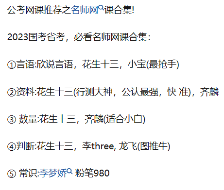
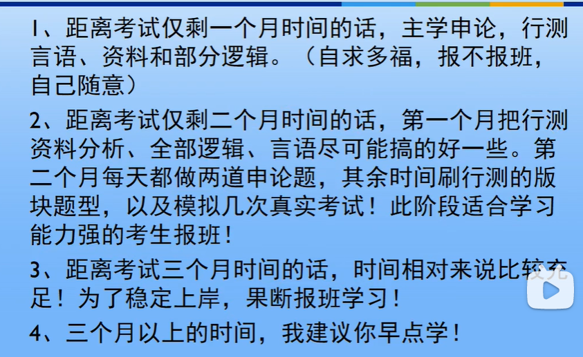

省考

报名序号151218

行测和申论

行测，是行政职业能力测验(英文名Administrative Aptitude Test，简称AAT)的简称，它和智力测验一样，属于心理测验的范畴。

它用来测试应试者与拟任职位相关的知识、技能和能力，是考查应试者从事公务员工作所必须具备的一般潜能的一种职业能力测试。行政能力测试是国家公务员考试公共笔试的一门，也是其中难度较大的一项。

数量关系

- 数学运算
- 数字推理

数学运算

- 四选一客观单选题，选项是有机组成部分
- 正面求解相当困难，结合选项来看相当容易
- 广泛应用于：
  - 多位数问题、不定方程问题、同余问题、年龄问题、周期问题、复杂行程问题、和差倍比问题等等
- 不仅可以一招制胜，还可与其它方法结合使用

信息发布

河南省人力资源和社会保障厅网站（http：//hrss.henan.gov.cn）、河南人事考试网（http：//www.hnrsks.com）

报名：

河南人事考试网

审核：初次报名自动审核，保存成功即为初审成功

**1.提交报名申请及资格初审**

报考者于1月9日9∶00至1月16日17∶00，登录河南人事考试网

**2.报名确认和缴费**

通过资格审查的报考者，

于1月20日9∶00至1月30日17∶00前进行网上报名确认并缴费

**3.打印准考证**

[网上报名系统 (qzpta.cn)](https://ks2.qzpta.cn:2186/208zmd/index.html#/login)

已确认并缴费的报考者，于2月21日9∶00至2月26日9∶30期间，登录报名确认和缴费网站自行下载打印准考证。

https://hrss.zhumadian.gov.cnhttp://rcjlzx.hrss.zhumadian.gov.cn

[网上报名 | 驻马店市人力资源和社会保障局网上服务大厅 (zhumadian.gov.cn)](https://hrss.zhumadian.gov.cn/index.php/online_application)

①限报考一个职位

②报名缴费人数与拟录用人数的比例应当不低于5∶1

③招考职位被取消的报考者可于2月6日17∶00前登录河南人事考试网（http：//www.hnrsks.com）重新选报其他职位

报考者按每人每科30元缴纳笔试考务费。

笔试：

行测100分，申论100分

笔试成绩＝行政职业能力测验成绩×50%＋申论成绩×50%。

公安机关人民警察职位笔试成绩＝行政职业能力测验成绩×40%＋申论成绩×30%＋公安专业科目成绩×30%。

**2.时间地点。**

2月25日上午9∶00—11∶00，行政职业能力测验；

2月25日下午14∶00—16∶30，申论；

2月26日上午9∶00—11∶00，公安专业科目。

**3.成绩查询。**笔试结束后，由省公务员主管部门研究确定笔试最低合格分数线。

报考者可于3月24日后登录河南省人力资源和社会保障厅网

面试：

根据拟录用人数与参加面试人数1:3的比例，按照笔试成绩从高分到低分的顺序，确定各职位参加面试的人选

面试采取结构化面试或结构化小组面试方式，主要测试履行职位职责所要求的基本素质和能力，满分100分。

面试确认期间出现的空缺，由相关省辖市公务员主管部门、省直招录机关（单位）发布**递补**公告，根据缺额从报考同一职位的人员中按笔试成绩从高分到低分的顺序等额依次递补。**递补只进行一次**，如等额确定的递补人选仍出现空缺，不再递补。

面试时间初步定为4月中下旬

（三）考试总成绩

考试总成绩＝笔试成绩＋面试成绩。

笔试成绩、面试成绩和考试总成绩，均计算到小数点以后两位数。

最低服务年限5年

备考

​    

​    

作者：黑玫瑰猕胡桃链接：https://www.zhihu.com/question/48166411/answer/1665818062来源：知乎著作权归作者所有。商业转载请联系作者获得授权，非商业转载请注明出处。

- 网课

**粉笔980系统班——————推荐指数：⭐⭐⭐**

**980系统班基础知识讲解的很详细，非常容易听懂，完全可以代替教材。**但整体节奏偏慢，内容比较基础，相信看过教材后再听会有很多重复的点，看起来太费时间了，时间一长容易犯困，总的来说比较适合备考时间较长的小伙伴，短期备考不推荐。

**阿甘上岸说——————推荐指数：⭐⭐⭐⭐⭐**

**这门课知识点和技巧都有讲解，但总的来说更偏重做题技巧和方法，通过刷题把技巧打磨透彻，分数肯定不会低，刷题前建议多刷两遍。**我看的时候会先跟着老师的节奏一起走，边看边记，仔细听老师的解析和方法，把方法和题型一一对应起来。

看的时候要把重点放在言语、判断、资料这三大模块，熟悉老师总结的公式，通过刷题把技巧练熟，很快就能定位到中心词、中心句、关键数据等突破点上，速度和正确率自然不用担心。

**李委明数量关系——————推荐指数：⭐⭐⭐⭐**

**数量关系这块讲的确实可以，讲的很多速算秒杀方法**，华图模块宝典的数量关系模块就是他编写的。但数量这个模块比较尴尬，对于一般考生来说，数量是不会优先去看的，毕竟难度在那放着呢，还是看得看自己的选择。

- 练习题

**华图模块宝典——————推荐指数：⭐⭐⭐⭐**

知识点与题型的集合体，分模块单独成册，讲解的挺详细，题目较多，性价比还可以，就是纸张摸起来质感不算精良，内容倒是没有问题。

**粉笔行测5000题、申论100题——————推荐指数：⭐⭐⭐⭐⭐**

**粉笔最早就是做题库出身的，里面的题包含历年国考、各省市真题，按一个模块模块整理归纳的，可以配合着网课做专项训练是个狠好的选择，**注意做错的题一定要重点看解析。申论则重点看思路、框架和如何踩点，毕竟题是活的，书是死的，注重总结就行。

**历年真题套卷——————推荐指数：⭐⭐⭐⭐⭐**

**真题套卷的地位是怎么都无法动摇的**，公务员考试真题的重要性想必大家都清楚，自己买题来做或是在网上打印都可以，不管怎么样一定得有。

建议按照考试的标准时间去做，找一个整块的时间一口气完成，千万别今天做几道，明天写几道的，这就失去套卷的价值了。时间允许的话可以上午行测，下午申论，跟考试吻合。

**其他类**

**粉笔APP——————推荐指数：⭐⭐⭐⭐⭐**

**良心APP，里面几乎有所有的公考试题，当然是电子版的，重点还是免费的！免费的！**等公交、地铁的时候就可以拿出手机刷刷，但电子版的题做起来有些小问题，不能动笔做做标记，特别是写资料分析的时候很不方便。

另外每周日还有粉笔模考，不过题目会偏难，别被打击积极性就好了，哈哈~~做完还有解析课，有时间可以听听，没时间也要好好看看解析，算是一个很不错的福利。

**人民日报APP——————推荐指数：⭐⭐⭐⭐⭐**

**想要词藻漂亮、体面，就需平时积累，人民日报里面的文章百分之八十都是议论文，对大作文写作很有帮助**，主要看第五版评论板块，慢慢体会官方对热点问题的态度和看法，练的时候有意识的往上靠。

​    