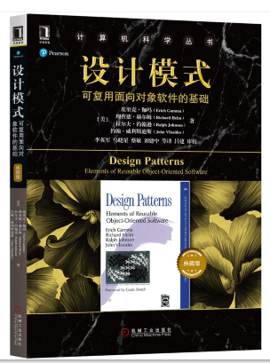
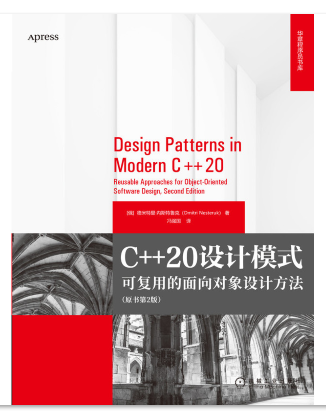
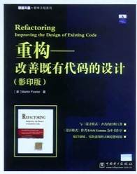
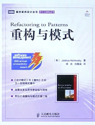

# 设计模式

## 目标

- 理解松耦合设计思想
- 掌握面向对象设计原则
- 掌握重构技法改善设计
- 掌握GOF核心设计模式

## 什么是设计模式

“每一个模式描述了一个在我们周围不断**重复**发生的问题， 以及该问题的**解决方案**的核心。这样，你就能一次又一次 地使用该方案而不必做重复劳动。”——Christopher Alexander

## 设计模式书籍推荐

## 面向对象简介

底层思维：向下，如何把握机器底层 从微观理解对象构造

- 语言构造
- 编译转换
- 内存模型
- 运行时机制

抽象思维：向上，如何将我们的周围 世界抽象为程序代码

- 面向对象
- 组件封装
- 设计模式
- 架构模式

向下：深入理解三大面向对象机制

- 封装，隐藏内部实现
- 继承，复用现有代码
- 多态，改写对象行为

向上：深刻把握面向对象机制所带来的抽象意义，理解如何使用 这些机制来表达现实世界，掌握什么是“好的面向对象设计”

## 软件设计的复杂性

建筑商从来不会去想给一栋已建好的100层高的 楼房底下再新修一个小地下室——这样做花费 极大而且注定要失败。然而令人惊奇的是，软件 系统的用户在要求作出类似改变时却不会仔细考 虑，而且他们认为这只是需要简单编程的事。——Object-Oriented Analysis and Design  with Applications。Grady Booch

## 软件设计复杂的根本原因

### 变化

- 客户需求的变化
- 技术平台的变化
- 开发团队的变化
- 市场环境的变化
- ...

## 如何解决软件设计的复杂性

分解

- 分而治之，将大问题分 解为多个小问题，将复杂问题分解为多个简单问题

抽象

- 由于不能掌握全部的复杂对象，选择忽视其非本质细节， 处理泛化和理想化的对象模型

## 软件设计的目标

复用

# 面向对象设计原则

依赖倒置原则(DIP)

- 

开放封闭原则(OCP)

单一职责原则(SRP)

Liskov替换原则(LSP)

接口隔离原则(ISP)

组合优于继承原则()

封装变化点

针对接口编程而不是针对实现编程

# 设计模式分类

根据目的

- 创建型模式
- 结构型模式
- 行为型模式

根据范围

根据封装变化角度

- 组件协作
- 单一职责
- 对象创建
- 对象性能
- 接口隔离
- 状态变化
- 数据结构
- 行为变化
- 领域问题

# 重构获得设计模式

书籍推荐

重构关键技法

1. 静态(绑定)->动态(绑定)
2. 早绑定->晚绑定
3. 继承->组合
4. 编译时依赖->运行时依赖
5. 紧耦合->松耦合