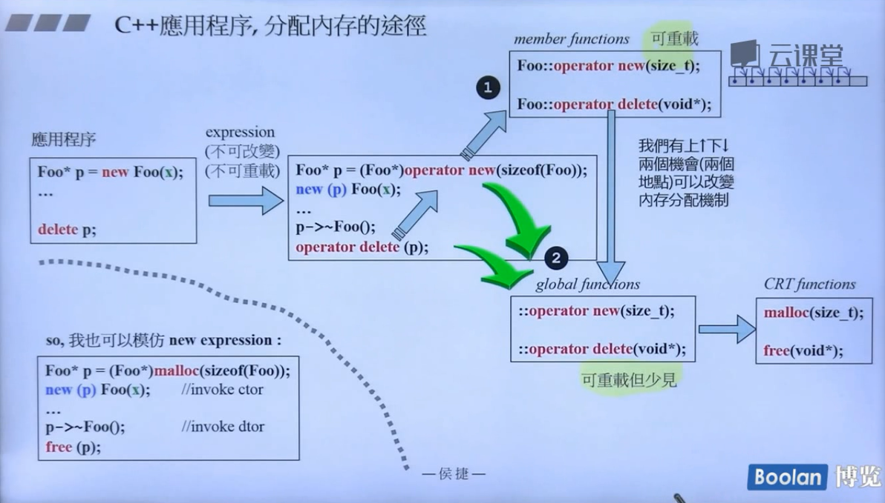
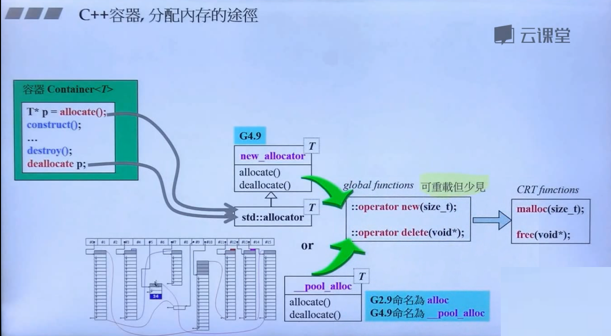
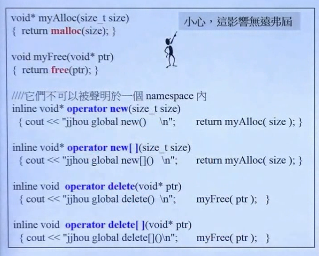
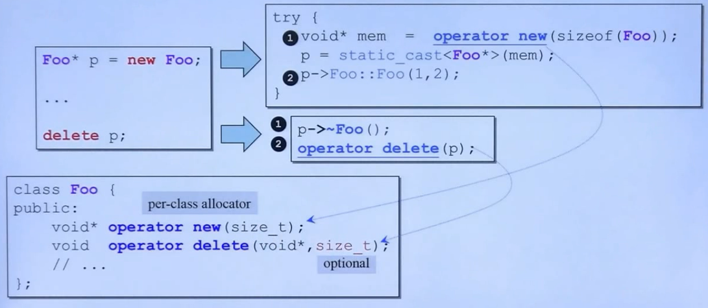
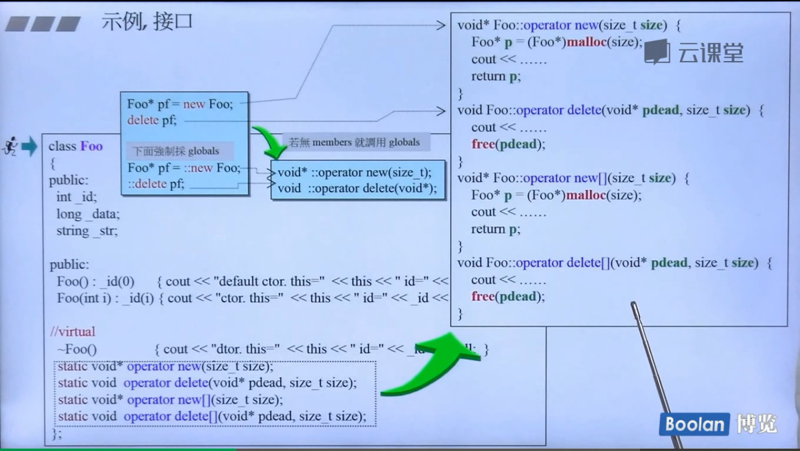

http://clang.llvm.org/

https://gcc.gnu.org/

https://software.intel.com/en-us/c-compilers

http://llvm.org/

https://docs.microsoft.com/en-us/cpp/dotnet/dotnet-programming-with-cpp-cli-visual-cpp?view=msvc-160

## new

## array new

## placement new

C++应用程序，分配内存的途径

## 重载::operator new/::operator delete

全局

# 重载operator new/operator delete

# 重载operator new[]/operator delete[]

# 重载实例

# 重载new()/delete()

placement new，