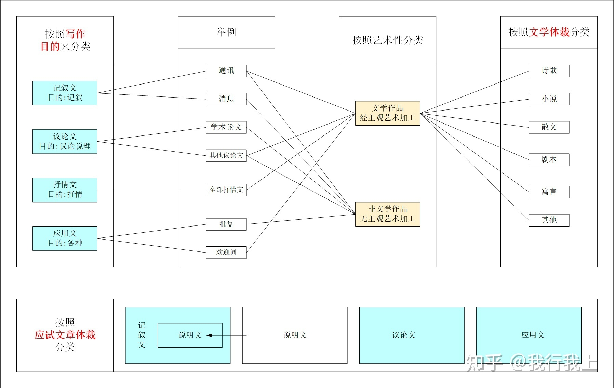

文体分类

- 实用文体
  - 记叙文：消息、通讯、回忆录、传记、家史等
  - 说明文：科普说明文、辞书、教科书、说明书等
  - 议论文：政论、评论、序跋、杂文、学术论文等
  - 应用文：条据、规约、书信、公文、各类文书等
- 文学文体
  - 诗歌：抒情诗、叙事诗、散文诗
  - 散文：议论散文、叙事散文、抒情散文、*报告文学*
  - 小说：长篇-中篇-短篇-微型小说、寓言、童话、故事、科幻小说
  - 戏剧：话剧、歌剧、歌舞剧、戏曲、*影视文学* 等

