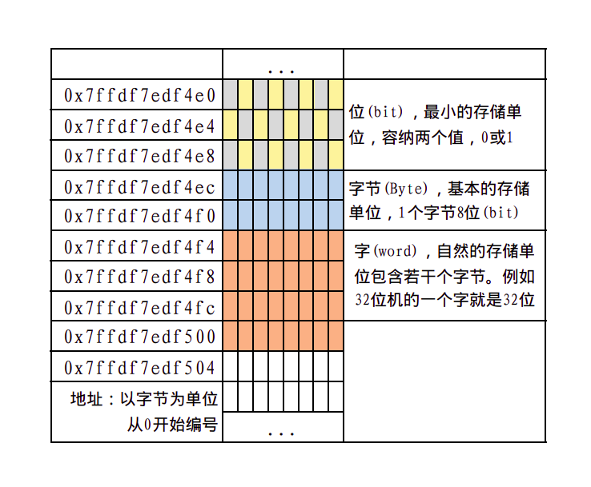
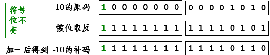
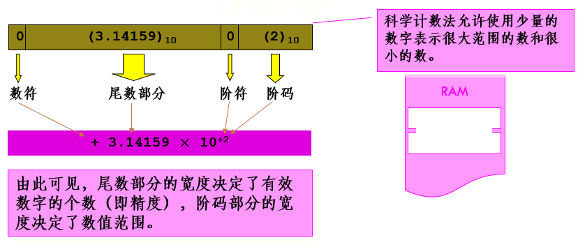

# 走近C语言程序设计 

## 本章大纲

-  C语言程序的基本结构
-  C语言的字符集和关键字
-  C语言的数据类型
-  C语言的格式输入输出
-  C语言的算数运算符和运算规则
-  C语言的关系运算符和运算规则 

```cpp
/* 在屏幕上显示Hello World! */  
#include <stdio.h>
void main(){    /* 定义主函数 */
 printf("Hello World!\n");
}
```

`/*... */` ：注释部分，以增加程序的可读性，不被执行

`#include`： 预处理命令，包含某一文件内容到本文件

函数：C程序由函数组成，**一个C程序有且仅有一个主函数（main函数）****。**

`void main()`; 函数说明：说明函数返回值类型、函数名和函数参数

`{ }` ：函数体，包括变量说明和语句执行部分

 

 

#### １. C语言程序的基本结构

（１）注释

- 单行注释：**／／注释内容**
- 多行注释：**／＊注释内容＊／**

（２）预处理命令：**#include** 包含某个文件

（３）函数：

- C程序由**函数**组成。
- 一个C程序**有且仅有**一个主函数main（）

```c
/* 在屏幕上显示Hello World! */
#include <stdio.h> //预处理命令
void main(){ //函数说明：说明函数类型、函数名和函数参数
  printf("Hello World!\n");
} //｛ ｝之间为函数体：包括变量说明和语句执行部分
```

（４）

- 一个C程序由**一个或多个函数**组成，但**有且仅有**一个主函数（main函数）；main函数是**程序执行的入口**，可置于程序的**任何位置**。
- 程序中可以有**预处理命令**(如：include 命令)。预处理命令通常放在程序的最前面。
- **每个语句以分号结尾；预处理命令、函数头和花括号“}”之后不能加分号。**
-  函数包括函数的说明部分和函数体；函数体包括变量说明部分和执行部分；函数体由一对花括号“{ }”括起来。
- 括在/*…*/内的文本为多行注释。
- 一行可以写多个语句，一个语句也可以写在多行上。
- 程序**区分大小写字**母。一般变量、语句等用小写字母书写；符号常量、宏名等用大写字母书写。
- 标识符和保留字之间须加空格以示分隔。

 

#### ２．C语言的字符集

​         ——来自ASCII表

- Letters（52个大小写字母）
- Digits（10个）
- Blanks（空白符）：空格符、制表符、回车符、换行符
- 图形符号（Graphic characters）：! # % ^ & * ( _ ) - + = ~ [ ] ' | \ ; : " {} , . < > / ?

 

#### 3. C语言的关键字

关键字也称为保留字

-  类型说明

```c
int、long、short
float、double
char
unsigned、signed
const、void、volatile
struct、union、enum 
```

- 语句定义

```c
if、else、
goto、
switch、case、default
do、while、for、
continue、break、
return、typedef
```

- 存储类别说明：

```c
auto、register、extern、static
```

- 长度运算符：

```c
sizeof
```

#### 4. C语言的标识符

**标识符**（Identifiers）是程序中引用对象的名称，用来标识变量、符号常量、数组、函数、结构体、共用体、自定义类型等

**命名规则**

- 只能包括大小写**字母**、**数字**和**下划线**；
- **首字符必须是字母或下划线**；
- 一般标识符的**前31**个字符有效；（视具体编译器的规定）
- 不能与关键字相同。

#### 5. C语言的数据类型

- 基本类型：整型，字符型，浮点型，枚举类型
- 构造类型： 结构体，共用体，数组
- 指针类型
- 空类型

 

#### 6. 存储单元

计算机内部存储器的部分空间，一般规定了相应的字节长度

**赋值： 破坏性的**

读值：非破坏性的

数据、常量、变量、数据类型、

位、字节、字：

 

字 ：即机器字长，是自然的存储单位。计算机是多少位的，一个字就又多少位。（如64位的机器，一个机器字长就是64位）

#### **整数：**

（1）有符号正整数：以二进制补码形式存放，正整数的补码与原码相同


（2）有符号的负整数：以二进制补码的形式存放




（3）无符号整数：所有二进制位都存放数值


------


C标准只规定：**short ≤ int ≤ long**

最大最小值参考<limits.h>

 

整型常量：

- 十进制decimal：99、65535
- 八进制octal：**0**177、0173
- 十六进制hexadecimal：**0x**fff、0X43D

整型常量**默认**类型是**int**，即有符号的基本整型。加上后缀 **u 或 U** 表示**无符号整数**，或者 l 或 L 表示长整数。0xb5Lu

 

整型变量声明：

类型说明符 变量名1，变量名2，...，变量名n；

```c
int height;//变量声明创建了变量：为变量分配了存储空间（存储空间内部存储的是垃圾值 ）

height=288;//初始化变量height，破环了原有存储空间的值
```

整型变量初始化：

破坏变量声明后的存储空间值，存入新的值


整数溢出：超出整数类型的数值范围。

#### 字符的存储方式

字符编码：

- 计算机使用一种数字编码（整数）来表示字符，每一个字符都对应一个特定的整数。

- 常用的编码是ASCII（美国信息交换用标准码）。

- - 7位二进制数，十进制码值范围从0到127。
  - 一般用一个字节保存，最高位为0。

字符的存储方式与整数相同

- 举例

- - 字母A的ASCII码值为65，
  - 那么在内存中以65的二进制形式存储，
  - 且占一个字节。


字符类型和字符变量

字符类型char

- 占一个字节；

- 可视为一个有符号的整数。

字符常量

- 用单引号括起来的一个字符。

- C语言将字符常量视为int类型。

'x'   '9'   '+‘

char c1, c2;

c1='a';

c2='bc';

- char类型为8位,一个字节，对于’bc’，将把’b’和’c’的ASCII码值存储在两个字节中，并把’c’赋值给变量c2。不同系统处理方式不同，结果不同。


转义字符

```c
\a 警报      \\ 反斜杠（\）

\b 退格      \? 问号（?）

\f 走纸      \' 单引号（’）

\n 换行     \" 双引号（”）

\r 回车      \ooo 八进制值（o表示一个八进制数字）

\t 水平制表符  \xhh 十六进制值（h表示一个十六进制数字）

\v 垂直制表符
```

#### 浮点数存储方式

\* 浮点型数据在内存中按指数形式存放。

314.15




s = ±1


浮点数常量：

- 十进制形式

12.3  .65  0.534

- 指数形式：< 小数 > < e | E > < 整数 >

1.2e-2   .1E5   7E0

- 默认类型是double。
- 可以加上后缀 f 或 F 表示float类型，或者 l 或 L 表示long double类型，否则该常量是double类型。

2.3f  1.2L  .1E5f

float和double对应的格式说明符为%f、%e。

浮点数舍入误差

```c
#include <stdio.h>
int main() {
 float a, b;
 a=123456.789e5;
 b=a+20;
 printf("a=%f\nb=%f", a, b);
}
```


a+20的理论值应该是：12345678920

但是，一个实型变量能够保证的有效数字是7位，后面的数字将被舍去，是没有意义的。

因此，最后得到

b=12345678848.000000

应当避免一个很大的数和一个很小的数直接相加或相减，否则就会“丢失”较小的数。

 

浮点数溢出：

上溢出

```c
#include <stdio.h>
int main()
{
  float toobig = 3.4e38 * 100.0f;
  printf(" %f", toobig);
}
```


 

下溢出

 

 

#### 数据类型小结

- 基本的数据类型包括两大类：

- - 整数类型
  - 浮点类型

- 一般使用int和float表示数，用char表示字符。

- 在使用变量的函数的可执行语句之前声明该变量，并为它选择有意义的名字。

- 初始化变量使用的常量应当与变量的类型相匹配。


 


[(144条消息) C++与C数据类型的区别_偷包米的贼的博客-CSDN博客_数据结构c和c++区别](https://blog.csdn.net/qq_33963178/article/details/120475271)

 

 

 

 

 

 

 

 

 

 

 

 

 

 

 

 

 

 