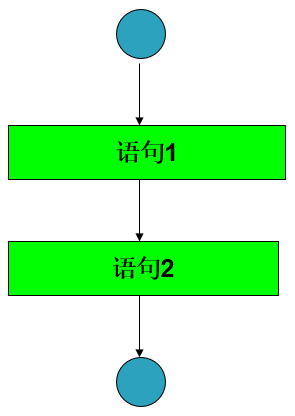
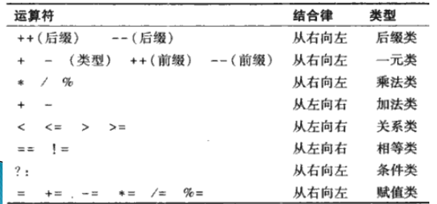

# 结构化的C程序设计

## 本章大纲

- 自顶向下、逐步求精的算法设计
- 简单的选择语句
- 采用while循环语句重复执行一段语句
- 计数控制循环和标记控制循环
- 结构化程序设计

**引言**

在编写程序来求解一个特定的问题之前，透彻地**理解问题**以及仔细地**设计解决**问题的**办法**是至关重要的。

**算法**

求解一个问题的流程称为算法。

- 将要执行的**操作**
- 执行这些操作的**顺序**

**语句**：在程序中，将要执行的一个操作称为一个**语句**。

**程序控制**

在一个计算机程序中，定义程序语句的**执行顺序**被称为程序控制

**伪码**

伪码是一种人工的、非正式的辅助人们进行算法设计的语言。

- 易于转换成相应的C程序
- 编写伪码时可以不进行变量定义

**控制结构**

顺序执行：通常情况下，计算机程序中的语句是按照它们被编写的顺序逐条执行的，称为顺序执行。

控制转移：下一条要执行的语句不是当前语句的后继语句

Bohm的研究结论：

- 可以不使用goto语句来编写计算机程序

- 任何计算机程序可以仅用三种控制结果来实现

- - 顺序结构
  - 选择结果
  - 循环结构

**顺序结构**：使语句顺序执行的结构。

- 顺序结构是C语言的内在结构，除非特别指明，计算机总是自动地按照C语句在程序中被编写的顺序，逐条地执行这些语句。

**流程图**：流程图是一个或一段算法的图形化表示。

- 特定意义的图框
- 流程线（箭头）

顺序结构流程图：

- 矩形框：计算等处理操作
- 箭头：执行顺序
- 圆圈：开始或结束



**选择结构**

- 单分支：if 语句

- 双分支：if 语句1 else 语句2

- 多分支：

- - switch 语句
  - if 语句1 else if 语句2 else 语句3

**循环结构**

- while循环
- do while循环
- for循环

1、C语言全部的七种控制结构 ：顺序结构，三种选择结构，三种循环结构

2、结构化程序设计是基于这七种结构进行设计的。任何一个C语言程序，根据程序所实现算法的需要，由这七种结构组合而成。

3、顺序结构的单入口/单出口的控制结构易于实现程序的模块化设计。

4、结构化程序构建方法

- 堆叠
- 嵌套

语句示例

if单分支

```c
if ( grade >= 60 ) {
	printf("Passed\n");
}
```

if else 双分支

```c
if (grade >= 60){
    printf("Passed\n");
}else{
    printf("Failed\n");
}
// grade >= 60 ? printf ( Passed” ) :
printf("Failed");
```

if else 嵌套

```c
if (grade >= 90)
  printf("A\n");
else if (grade >= 80)
  printf("B\n");
else if (grade >= 70)
  printf("C\n");
else if (grade >= 60)
  printf(" D\n");
else
  printf("F\n");
```

**语句块**（复合语句）：包含在一对大括号内的一组语句。

- 复合语句在语法上等同于一个语句
- 在程序中可以放置单个语句的任何地方，都可以放置复合语句。
- 在可以放置单个语句的任何地方也可以不放置任何语句，即一条空语句。空语句就是仅有一个分号（;）

```c
if (grade >= 60) {
  printf("Passed\n");
  printf("Congratuation!\n");
} else {
  printf("Failed\n");
  printf(" Sorry!\n");
}
```

while循环

```c
while (condition) {
  // 循环体
}
int product = 3;
while (product <= 100) {
  protuct = 3 * product;
}
```

**计数控制的循环**

**问题描述**：一个班级有10个学生，请计算语文考试的平均成绩（满分100）？

**算法要求**：

- 首先输入每一名学生的成绩
- 然后计算平均分
- 最后输出结果

**解决方案**

- 用伪码来描述要执行的操作及其执行顺序
- 采用计数控制的循环（确定性循环）来逐个输入学生的成绩

**书写伪码**

令总分total 等于0

令分数计数器counter等于1

While 分数计数器counter的值小于或等于10时

   输入该分数grade

   将该分数grade加到总分数total中

   将分数计数器 counter的值加1

令班级平均分 average 等于总分total 除以学生人数10

输出班级平均分 average

**编写代码**

```c
int main()
{
    int counter;
    double grade;
    double total;
    double average;
    total = 0;
    counter = 1;
    while (counter <= 10)
    {
        printf("enter grade: ");
        scanf("%lf", &grade);
        total = total + grade;
        counter = counter + 1;
    }
    average = total / 10;
    printf("class average is %lf\n", average);
    return 0;
}
```


**问题描述**：设计一个每次运行时能够处理任意个成绩的平均分的程序。

```c
int main(){
    int counter;
    int grade;
    int total;
    double average;
    total = 0;
    counter = 0;
    printf("enter grade,-1 to end: ");
    scanf("%ld", &grade);
    while (grade != -1){
        // printf("enter grade: ");
        // scanf("%lf",&grade);
        total = total + grade;
        counter = counter + 1;
        printf("enter grade,-1 to end: ");
        scanf("%ld", &grade);
    }
    if (counter != 0){
        average = (double)total / counter;
    }else{
        printf("No grades were entered \n");
    }
    printf("class average is %.2lf\n", average);
    return 0;
}
```

**类型转换**

- 强制类型转换：(目标类型)原有类型 
- 隐式类型转换：编译器在对源程序进行编译时，将对不同类型的操作数进行类型提升，从而使其类型一致，称作隐式类型转换。

强制类型转换运算符

- 一元运算符
- 优先级比*、\和%等高一级
- 自右相左结合

一元正（+）、负（-）运算符

- 一元运算符
- 优先级比*、\和%等高一级，与强制类型转换运算符同级
- 自右相左结合

**浮点数输出**

- 格式转换说明符 ：%.2f

- - 浮点数类型输出
  - 小数点后输出两位
  - %f ：默认，小数点后输出六位

问题描述

10个人参加考试，1表示通过，2表示未通过。请设计程序，使其具有如下功能：

（1）输入每一名学生的考试结果（即“1”或“2”）。程序每次要求用户输入另一个考试结果时，都显示如下提示信息：Enter result(请输入考试结果）。

（2）统计每种考试结果的个数

（3）显示通过考试的学生总数和未通过考试的学生总数。

（4）如果通过考试的学生总数超过8名，则显示“Bonus to instructor”（奖励教师）。     

算法设计考虑

  1 这个程序要处理10个考试结果，可以采用计数控制的循环结构。

  2 考试结果是一个整数：1或2。每读入一个结果，程序必须判断它是1还是2.在本算法中，只测试是否是1，如果不是1，则认为是2。

  3 设置两个计数器变量，一个用来统计通过考试的学生总数，另一个用来统计未通过考试的学生总数。

  4 处理完所有的考试结果后，程序必须判断通过考生的学生总数是否超过8名。

```c
int main(){
    int passes = 0;
    int failues = 0;
    int student = 1;
    int result;
    while (student <= 10){
        printf("enter result (1=pass,2=fail): ");
        scanf("%d", &result);
        if (result == 1){
            passes = passes + 1;
        }else{
            failues = failues + 1;
        }
        student = student + 1;
    }
    printf("passed %d\n", passes);
    printf("failed %d\n", failues);
    if (passes > 8){
        printf("bonus to instrctor!\n");
    }
    return 0;
}
```

**赋值运算符**

 算数赋值运算符+=  -=  *=  /= %=

例：输入一个正整数，然后确定并打印该整数中各个位上的数字是7的个数。

```c
int main(){
    int num1; /* 用户输入的正整数 */
    int num2; /* 计算用中间变量 */
    int digit; /* 尾数字 */
    int amount = 0; /* 7的个数 */
    printf("请输入一个正整数：");
    scanf("%d", &num1);
    num2 = num1;
    while (num2 >= 7){
        digit = num2 % 10; /* 尾数字*/
        if (digit == 7) amount++;
        num2 /= 10;
    } /* while循环结束 */
    printf("整数%d中含有%d个数字7\n", num1, amount);
    return 0;
} /* 主函数结束 */
```

**增1减1运算符**

- 增1运算符：++

- - 先增1/先减1：++a --a

  - - 将a的值增1/减1，然后在包含a的表达式中进行计算
    - 相当于使用（a+1)或（a-1)进行计算
    - a的值变成(a+1)或（a-1)

- 减1运算符：--

- - 后增1/后减1: a++ a--

  - - 在包含a的表达式中，使用a进行计算，然后将a的值增1/减1
    - 不使用（a+1)和（a-1)进行计算;
    - a的值变成(a+1)或（a-1)

1、一元运算符必须直接写在它们的操作数旁边，二者之间不允许插入空格，这是一元运算符与二元运算符的不同之处。

2、在一个只包含有一个变量的语句中，对变量使用先增1和后增1运算符的执行结果是相同的。

3、对一个表达式而非一个简单的变量名使用增1运算符或减1运算符，例如++(x+1)，是一个语法错误。



例子：回文检测。回文是一段数字或文本， 无论顺读还是倒读都是一样的。例如，下面这些五位数的整数都是回文：12321，55555， 45354和11611。请编写一个读入五位整数并判断其是否为回文的程序。

```c
int main() {
    int a; /* 用户输入的正整数 */
    int b; /* 计算用中间变量 */
    int d1; /* 倒数第一位数字 */
    int d2; /* 倒数第二位数字 */
    int d3; /* 倒数第三位数字 */
    int d4; /* 倒数第四位数字 */
    int d5; /* 倒数第五位数字 */
    printf("请输入一个五位数的正整数：");
    scanf("%d", &a);
    b = a;
    d1 = b % 10;
    b /= 10;
    d2 = b % 10;
    b /= 10;
    d3 = b % 10;
    b /= 10;
    d4 = b % 10;
    b /= 10;
    d5 = b % 10;
    if (d5 == d1 && d4 == d2) {
        printf("数字字符串%d是回文\n", a);
    }else {
        printf( "数字字符串%d不是回文\n", a );
    }
    return 0;
}
```

章小结

- 算法就是要执行的操作及其操作的顺序。
- 伪码与日常使用的英语极为类似，它并不是一种真正的计算机程序设计语言。
- 使用结构化程序设计技术编写的程序，更清晰可读、易于修改、易于查错排错。
- 任何计算机程序都可以仅用顺序结构、选择结构和循环结构来实现。
- 流程图可以用图形化的方式直观地描述算法。
- 自顶向下、逐步求精的方法是一种有效的程序设计方法。