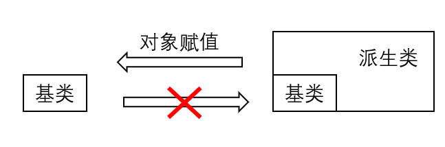

# C++多态性

## 本章大纲

- 复制兼容
- 多态概念
- 虚函数
- 虚析构函数
- 抽象类和纯虚函数
- 强制转换

## 赋值兼容

赋值兼容规则：可以将<strong style="color:red">公有</strong>派生类对象赋值给基类对象，反之是不允许的。



结果：将派生类对象中从基类继承来的成员赋给基类对象。

```cpp
#include <iostream>
using namespace std;
class Point {
 protected:
  int x, y;  // 保护成员
 public:
  Point(int a = 0, int b = 0) {
    x = a;
    y = b;
  }
  void Show() { cout << "point(" << x << "," << y << ")\n"; }
};
class Line : public Point  // 公有继承
{
 protected:
  int x1, y1;

 public:
  Line(int a, int b, int c, int d)
      : Point(a, b)  // 调用基类构造函数
  {
    x1 = c;
    y1 = d;
  }
};
int main() {
  Line line(2, 2, 6, 6);
  Point p;
  p = line;  // A
  p.Show();
  return 0;
}
//输出：
point(2,2)
```

赋值兼容要点：

1. 派生类对象可以赋值给基类对象，系统将派生类对象中从基类继承来的成员赋给基类对象
2. 不能将基类对象赋值给派生类对象
3. **私有或保护继承**的派生类对象，不可以赋值给基类对象。
4. 可将派生类对象的地址赋给基类指针变量。例 `Point *ptr = &line;`

5. **派生类对象可初始化基类的引用**。例如 `Point &refp = line;`
6. 在后两种情况下，使用基类指针或引用时，只能访问<strong style="color:red">从相应基类中继承</strong>来的成员，而不允许访问<strong style="color:red">其他基类成员或派生类中增加</strong>的成员。

## 多态概念

多态性是指发出<strong style="color:red">同样的消息</strong>被<strong style="color:red">不同</strong>类型的<strong style="color:red">对象</strong>接收时有可能导致完全<strong style="color:red">不同的行为</strong>。

### 多态的实现

在C++程序设计中， 多态的实现

- **函数重载**
- **运算符重载**
- **虚函数**

### 多态分类

#### 编译时多态

在程序编译时系统就能决定调用的是哪个函数。

- 函数重载

- 运算符重载

#### 运行时多态

- **通过继承关系和虚函数来实现。**

- 在程序执行前，无法根据函数名和参数来确定该调用哪一个函数，必须在程序执行过程中，根据执行的具体情况来动态地确定。

## 类继承层次中指针和对象之间的关系

基类指针、派生类指针、基类对象、派生类对象 之间的4种关系：

- 直接用基类指针指向基类对象
- 直接用派生类指针指向派生类对象
- 派生类对象给基类指针赋值（基指针指向派对象）
- 基类对象给派生类指针赋值。(编译会出错）

## virtual函数（虚函数)

```cpp
#include <iostream>
using namespace std;
class B0  // 基类B0声明
{
 public:
  // 外部接口
  void display() { cout << "B0::display()" << endl; }
};
class B1 : public B0  // 公有派生
{
 public:
  void display() { cout << "B1::display()" << endl; }
};
class D1 : public B1  // 公有派生
{
 public:
  void display() { cout << "D1::display()" << endl; }
};
void fun(B0 *ptr)  // 普通函数
{
  ptr->display();
}
int main()  // 主函数
{
  B0 b0, *p;
  // 声明基类对象和指针
  B1 b1, *q;
  // 声明派生类对象
  D1 d1;
  // 声明派生类对象
  p = &b0;
  q = &b1;
  fun(q);
  fun(p);
  p = &b1;
  fun(p);
  p = &d1;
  fun(p);#include <iostream>
using namespace std;
class Base {  // 基类Base声明

 public:
  // 外部接口
  void display() { cout << "Base::display()" << endl; }
};
class B1 : public Base {  // 公有派生

 public:
  void display() { cout << "B1::display()" << endl; }
};
class D1 : public B1 {  // 公有派生

 public:
  void display() { cout << "D1::display()" << endl; }
};
void fun(Base *ptr) {  // 普通函数

  ptr->display();
}
int main() {
  // 声明基类对象和指针
  Base base, *ptr_base;
  // 声明派生类对象
  B1 b1, *ptr_b1;
  // 声明派生类对象
  D1 d1;
  ptr_base = &base;
  ptr_b1 = &b1;
  fun(ptr_b1);    // Base::display()
  fun(ptr_base);  // Base::display()
  ptr_base = &b1;
  fun(ptr_base);  // Base::display()
  ptr_base = &d1;
  fun(ptr_base);  // Base::display()
}
```

- 若将**派生类对象的地址**赋给指向**基类的指针（基指派）**，则用**该指针**仅能访问**派生类中从基类继承**来的公有成员，<strong style="color:red">通过指针引起的普通成员函数调用，仅仅与指针的类型有关，而与指针正指向什么对象无关。</strong>在这种情况下，必须采用**显式的方式**调用派生类的函数成员。
- （虚函数引入背景）本来使用对象指针是为了表达一种动态的性质，即<strong style="color:red">当指针指向不同对象时执行不同的操作</strong>，现在看来并没有起到这种作用。要实现这种功能，就**需要引入虚函数的概念**。

C++ 类中使用关键字**virtual** 修饰的成员函数

```cpp
virtual <数据类型> <函数名> (形参表)
{  
 函数体 
}

virtual <函数返回值> <函数名>(形参表);
```

- 本质：**是覆盖(override)**而不是重载(overload)声明。
- 虚函数是动态绑定的基础。是非静态的成员函数。
- 在类的声明中，在函数原型之前写virtual。**virtual 只用来说明类声明中的原型，不能用在函数实现时。**
- 一个函数一经说明为虚函数，则无论说明它的类被继承了多少层，在每一层派生类中该函数将永远保持其 virtual 特性。
- 具有继承性，基类中声明了虚函数，派生类中无论是否说明，同原型函数都自动为虚函数。
- 当基类中的某个成员函数被声明为虚函数后，此虚函数就可以在一个或多个派生类中被重新定义，在派生类中重新定义时，其**函数原型**，包括**返回类型、函数名、参数个数、参数类型以及参数的顺序**都必须与基类中的原型完全相同。

### 定义虚函数的目的

**为了让派生类覆盖（Overriding）它。**覆盖不同于重载，它要求重新定义的函数在参数和返回值方面与原函数完全相同。否则将属于重载（参数不同）或导致一个编译错误（返回值类型不同）。与函数重载相同，虚函数也体现了 OOP 技术的多态性。


- 一组虚函数中，两个虚函数**仅返回值不同**，参数和名字相同，**编译报错**。

### 虚函数调用方式

通过**基类指针或引用**，执行时会**根据指针指向的对象的类**，决定调用哪个函数。

```cpp
#include <iostream>
using namespace std;
class B0  // 基类B0声明
{
 public:                  // 外部接口
  virtual void display()  // 虚成员函数
  {
    cout << "B0::display()" << endl;
  }
};
class B1 : public B0  // 公有派生
{
 public:
  void display() { cout << "B1::display()" << endl; }
};
class D1 : public B1  // 公有派生
{
 public:
  void display() { cout << "D1::display()" << endl; }
};
void fun(B0 *ptr)  // 普通函数
{
  ptr->display();
}
int main()  // 主函数
{
  B0 b0, *p;  // 声明基类对象和指针
  B1 b1, *q;  // 声明派生类对象
  D1 d1;      // 声明派生类对象
  p = &b0;
  q = &b1;
  fun(q);
  fun(p);  // 调用基类B0函数成员
  p = &b1;
  fun(p);  // 调用派生类B1函数成员
  p = &d1;
  fun(p);  // 调用派生类D1函数成员
}
```

```cpp
#include <iostream>
using namespace std;
class base
{
public:
    virtual void fun1()
    {
        cout<<"base fun1"<<endl;
    }
    virtual void fun2()
    {
        cout<<"base fun2"<<endl;
    }
    void fun3()
    {
        cout<<"base fun3"<<endl;
    }
    void fun4()
    {
        cout<<"base fun4"<<endl;
    }
};
class derived:public base
{
    virtual void fun1()
    {
        cout<<"derived fun1"<<endl;
    }
    void fun2()
    {
        cout<<"derived fun2"<<endl;
    }
    virtual void fun3()
    {
        cout<<"derived fun3"<<endl;
    }
    void fun4()
    {
        cout<<"derived fun4"<<endl;
    }
};
void main()
{
    base *pb;
    derived d;
    pb=&d;
    pb->fun1();
    pb->fun2();
    pb->fun3();
    pb->fun4();
}
```

基类与派生类中有同名函数：

```cpp
#include <iostream>
#include <string>
using namespace std;
// 声明基类Student
class Student {
 public:
  Student(int, string, float);  // 声明构造函数
  virtual void display();       // 声明输出函数
 protected:                     // 受保护成员，派生类可以访问
  int num;
  string name;
  float score;
};
// Student类成员函数的实现
Student::Student(int n, string nam, float s)  // 定义构造函数
{
  num = n;
  name = nam;
  score = s;
}
void Student::display()  // 定义输出函数
{
  cout << "num:" << num << "\nname:" << name << "\nscore:" << score << "\n\n";
}

// 声明公用派生类Graduate
class Graduate : public Student {
 public:
  Graduate(int, string, float, float);  // 声明构造函数
  void display();                       // 声明输出函数
 private:
  float pay;
};
// Graduate类成员函数的实现
void Graduate::display()  // 定义输出函数
{
  cout << "num:" << num << "\nname:" << name << "\nscore:" << score
       << "\npay=" << pay << endl;
}
Graduate::Graduate(int n, string nam, float s, float p)
    : Student(n, nam, s), pay(p){};  // 主函数
int main() {
  Student stud1(1001, "Li", 87.5);
  Graduate grad1(2001, "Wang", 98.5, 563.5);
  Student *pt = &stud1;  // 定义指向基类对象的指针变量pt
  pt->display();
  pt = &grad1;
  pt->display();
  return 0;
}
```

由虚函数实现的动态多态性：**同一类族中不同类的对象，对同一函数调用作出不同的响应。**

### 虚函数的使用方法

1. 在基类用virtual声明成员函数为虚函数。在类外定义虚函数时，不能加virtual，会报错。
2. 在派生类中重新定义此函数。要求函数名、函数类型、函数参数个数和返回类型全部与基类的虚函数相同，并根据派生类的需要重新定义函数体。
3. 定义一个指向基类对象的指针变量，并使它指向同一类族中需要调用该函数的对象。
4. 通过该指针变量调用此虚函数，此时调用的就是指针变量指向的对象的同名函数。

- C++规定，**当一个成员函数被声明为虚函数后，其派生类中的同名函数都自动成为虚函数**。<strong style="color:red">因此在派生类重新声明该虚函数时，可以加virtual，也可以不加</strong>，一般在每一层声明该函数时都加virtual，使程序更加清晰。
- 如果在派生类中没有对基类的虚函数重新定义，则派生类简单地继承其直接基类的虚函数。
- 通过<strong style="color:red">虚函数</strong>和<strong style="color:red">指向基类对象的指针变量</strong>，能够方便地调用同一类族中不同类的同名函数，只要先用基类指针指向对应的派生类即可。

说明：

- 函数重载处理的是**同一层次**上的同名函数问题，而虚函数处理的是**不同派生层次**上的同名函数问题，前者是**横向重载**，后者可以理解为**纵向重载**。
- 与重载不同的是: **同一类族的虚函数的首部是相同的**，而**函数重载时函数的首部是不同**的(参数个数或类型不同)。