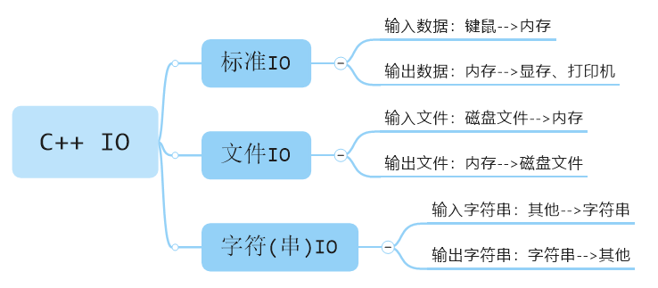
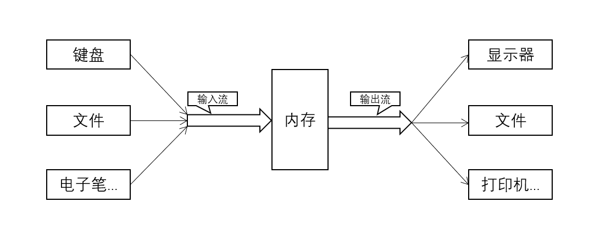

# C++ IO流

## 本章大纲

- 输出流和输入流的常用成员函数

- 流操纵符

- 流的错误状态

- 文件和流

- 文件操作
  - 打开文件
  - 读 / 写文件
  - 关闭文件

### C++ IO

#### IO类型

是什么类型的输入输出，要看输入输出的对象是什么

- 以**标准I/O**设备为对象
  - 从键盘、鼠标得到的数据是进入内存的，该数据是**输入数据**。
  - 将数据从内存送到显示器、打印机等，该数据是**输出数据**。

- 以**外存磁盘文件**为对象
  - 内存中的数据存储到磁盘文件中，叫**输出文件**；
  - 从磁盘文件中的数据装载入内存中，叫**输入文件**。

- 以**内存中指定的空间**作为对象
  - 常指定一个字符数组作为存储空间，这种I/O称为**字符串的输入输出**。



#### 数据流

- 数据之间的传输过程称作流(stream)
  - 输入流——表示数据从某个载体或设备传送到内存
  - 输出流——表示数据从内存传送到某个载体或设备

- 在进行I/O操作时
  - 首先进行“打开”操作，使流和文件发生联系
  - 建立联系后的文件才允许数据流入或流出
  - I/O结束后，使用“关闭”操作使文件与流断开联系



#### 流对象

- C++将I/O流定义为类，叫做流类，stream类。属于流类的对象是流对象。

- 系统已经以运算符或函数的形式做好了对标准外设（键盘、显示器、打印机、文件）的接口，使用时只需按照要求的格式调用即可
  - `cin`，标准输入流对象
  - `cout`，标准输出流对象

### IO流模板层次


### IO库各种流类

| 类名    | 作用 | 头文件 |
| ------- | ---- | ------ |
| ios     | 抽象基类 | \<iostream\> |
| istream | 通用输入流和其他输入流的基类 | \<iostream\> |
| ostream | 通用输出流和其他输出流的基类 | \<iostream\> |
| iostream | 通用输入输出流和其他输入输出流的基类 | \<iostream\> |
| ifstream | 输入文件流类 | \<fstream\> |
| ofstream | 输出文件流类 | \<fstream\> |
| fstream | 输入输出文件流类 | \<fstream\> |
| istrstream | 输入字符串流类 | \<strstream\> |
| ostrstream | 输出字符串流类 | \<strstream\> |
| strstream | 输入输出字符串流类 | \<strstream\> |

### 输入和输出流对象

- `cout`，标准输出
- `cerr`，标准错误输出，无缓冲，发送给`cerr`的内容立即被输出
- `clog`，类似`cerr`，有缓冲，缓冲区满时被输出
- `cin`，标准输入

### 标准输出流

数据流向：从**内存**流向**标准输出设备**(显示器)。

#### cout

在控制台(显示器)输出，用流插入运算符`"<<"`向`cout`输出数据

```cpp
cout << "a="<< a << endl;
cout << 数据1 <<数据2 << 数据3;
```

#### cerr

在控制台(显示器)输出错误信息，用流插入运算符`"<<`向`cerr`输出数据

```cpp
cerr << "除数为0, 出错!" << endl;
```

`cerr`的用法与`cout`类似。

- `cout`流对象与`cerr`流对象的不同之
  - `cout`的输出默认是显示器，但可以被重定向为输出到磁盘文件
  - `cerr`只能定向输出到显示器

#### clog

在控制台(显示器)输出错误信息，用流插入运算符`"<<"`向`clog`输出数据

```cpp
clog << "除数为0, 出错!" << endl;
```

`clog`的用法与`cerr`类似。

- `clog`流对象与`cerr`流对象的不同之处
  - `cerr`是不经过缓冲区，直接向显示器输出有关信息。
  - `clog`的输出先存储在缓冲区，遇到缓冲区满或遇到`endl`时才向显示器输出。

```cpp
void main() {
  float a, b, c, disc;
  cout << "输入a,b,c: ";
  cin >> a >> b >> c;
  if (a == 0)
    cerr << " a=0,  不是二次方程，出错！" << endl;
  else {
    disc = b * b - 4 * a * c;
    if (disc < 0)
      cerr << "二次方程无实根。" << endl;
    else {
      cout << "x1=" << (-b + sqrt(disc)) / (2 * a) << endl;
      cout << "x2=" << (-b - sqrt(disc)) / (2 * a) << endl;
    }
  }
}
```


### 标准输入流

### 文件操作与文件流


## 本章总结